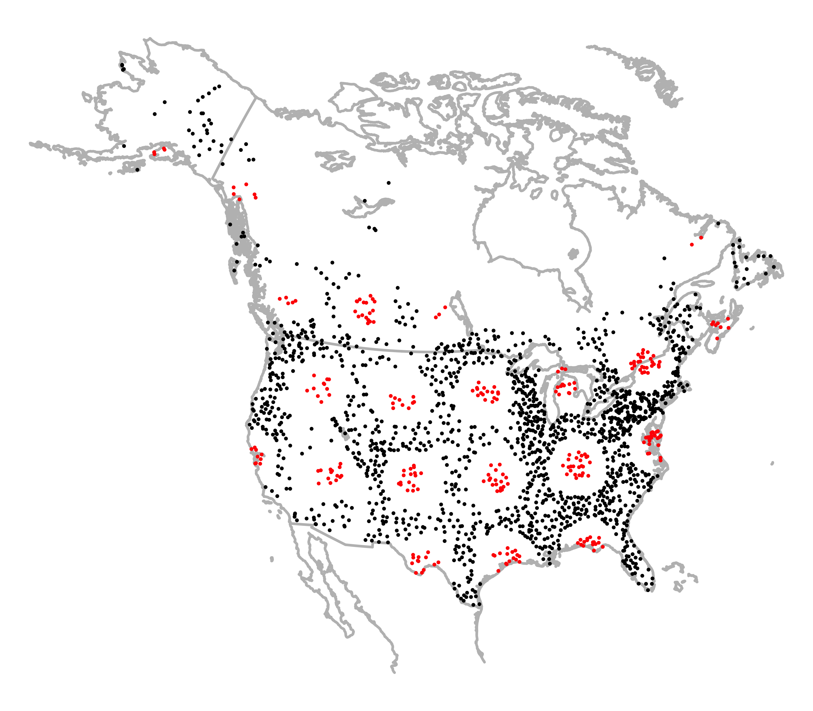

\numberwithin{figure}{section}
\pagenumbering{roman}
\setstretch{1}
\setlength{\parskip}{9pt}

\begin{center}

\textbf{Multi-Process Statistical Modeling of Species' Joint Distributions}  

By

DAVID JAY HARRIS

Bachelor of Arts (Washington University in St. Louis) 2008

DISSERTATION

Submitted in partial satisfaction of the requirements for the degree of

DOCTOR OF PHILOSOPHY

in

Population Biology

in the

OFFICE OF GRADUATE STUDIES

of the

UNIVERSITY OF CALIFORNIA

DAVIS

\vspace{18 pt}

Approved:

\setlength{\parskip}{20pt}

\underline{\hspace{8cm}}\\
Andrew Sih, Chair

\underline{\hspace{8cm}}\\
Marissa L. Baskett

\underline{\hspace{8cm}}\\
Richard McElreath

\vspace{18 pt}

Committee in charge

2015

\end{center}
\setlength{\parskip}{5pt}

\newpage

\hypersetup{linkcolor=black}
\tableofcontents
\setlength{\parindent}{1cm}

\newpage
\setstretch{2}
\setlength{\parskip}{6pt}

## Abstract

As a discipline, community ecology emphasizes a cluster of related questions: what processes cause some species to co-occur but not others? How can we accurately but economically describe the structure of an assemblage with many species? What kinds of assemblages are possible, and under what conditions?  Ecologists have developed a broad spectrum of largely-unrelated techniques for addressing different aspects of these closely-related questions, from modeling the multivariate geometry of the data with ordination techniques, to testing various metrics in the observed data against their null distributions, to fitting "stacks" of independent regression models describing each species' occurrence probabilities under different environmental conditions.  Each of these approaches relies on a different set of potentially-incompatible assumptions, and the conclusions drawn from one approach can be difficult to reconcile with those drawn from another.

In this dissertation, I propose a more unified approach, based on estimating the joint probability distribution across all the species. From this perspective, the objective is to determine how likely a given combination of species is likely to exist in nature, and under what conditions it could occur.  To the extent that the model structure includes the important ecological processes, such as environmental filtering and species interactions, then the roles of these processes can be inferred based on the model's coefficients.  When these different ecological forces are all included in the same model, ecologists can draw clearer conclusions about their relative importance than would be possible if each effect were tested separately with independent models that make potentially incompatible assumptions.

The models presented here take two complementary approaches toward this objective. Chapter 1 approaches the problem from the perspective of species distribution models (SDMs).  Ordinarily, SDMs only produce occurrence probabilities for individual species (rather than whole assemblages). For this reason, a "stack" of such models, which simply identifies sets of climatically-compatible species, can yield systematic errors at the assemblage level. To address this problem, Chapter 1 introduces a stochastic neural network model that estimates assemblage-level patterns using a combination of observed and latent environmental variables.  The latent variables, whose true values are not measured, enable the model to describe a mixture of different outcomes, and to concentrate its probability mass on assemblages with realistic co-occurrence patterns.

In Chapters 2 and 3, I address the more difficult question of how to detect direct interactions among pairs of species (such as competition and mutualism) using co-occurrence data. Detecting these interactions can be difficult, partly because of the large number of potential interactions among $n$ species, and especially because it is important to distinguish the effects of direct pairwise species interactions from other factors, such as indirect interactions or the effects of abiotic environmental variables.  Here, I show that assemblage-level co-occurrence patterns can be modeled using a set of direct interactions in a Markov network (an undirected graphical model also known as a Markov random field). Chapter 2 introduces this modeling approach and shows that it outperforms existing techniques in distinguishing direct interactions from indirect ones.  Chapter 3 introduces an approximation to the model's likelihood gradient, which enables ecologists to fit these models to much larger assemblages and to partition species' co-occurrence patterns into the component driven by biotic interactions and the component driven by abiotic environmental filtering.

\newpage

## Acknowledgements

I have been very fortunate to have Andy Sih as my advisor. His enthusiasm for good science of all kinds is infectious, as is his ability to attract excellent collaborators that are also great people.  Every quarter for seven years, some of my biggest steps forward in my research, my presentation skills, and in my development as a scientist came directly from the perspective that he and his lab group provided in the Sih lab meeting. Andy believed that I had valuable contributions outside his expertise in behavioral ecology and his encouragement to pursue my own interests was a major reason I succeeded in graduate school.

Richard McElreath's ideas regarding the process of scientific discovery by fallible human beings have played an important role in shaping my priorities for both statistical modeling and scientific education. His "Statistical Rethinking" course series has transformed graduate research in ecology at UC Davis for the better, and I wish him all the best at his new position in Germany.

Marissa Baskett's careful, thoughtful approach to science, writing, programming, and the big picture has provided an excellent model that I hope to follow throughout my career. Her thorough feedback and suggestions for simulation approaches were especially important for making Chapter 2 clear, readable, and relevant to non-specialists in statistical ecology.

Robert Hijmans helped give me the confidence to dive into the vast and unfamiliar literature on species distribution models halfway through my graduate career and to make contributions of my own.

A dissertation is an ultramarathon, and I'm deeply grateful to a number of other scientists for their help along the way; many of these are acknowledged at the end of each chapter.  I'd like to give special thanks to my friend Susannah Tysor, for always believing in me, and for helping me believe in myself.

Finally, I would like to thank Anna Perry, for her dedication, support, and love.  Whenever I've talked myself into a corner and didn't know how to proceed with my writing or research, her advice has always helped me see the solutions I'd missed.  Anna's integrity, conscientiousness, and commitment to doing her best in all areas of life is truly inspiring, and I love her for too many reasons to list here.

\newpage


\newpage

\pagenumbering{arabic}
\setcounter{page}{1}

\setstretch{1}

# Generating realistic assemblages with a Joint Species Distribution Model

\setstretch{2}

David J. Harris

\noindent
Previously published as @harris_generating_2015

## Abstract

1. Species distribution models (SDMs) represent important analytical and predictive tools for ecologists. Until now, these models have either assumed (1) that species' occurrence probabilities are uncorrelated, or (2) that species respond linearly to preselected environmental variables. These two assumptions currently prevent ecologists from modeling assemblages with realistic co-occurrence and species richness properties.

2. This paper introduces a stochastic feedforward neural network, called "mistnet", which makes neither assumption. Thus, unlike most SDMs, mistnet can account for non-independent co-occurrence patterns driven by unobserved environmental heterogeneity. And unlike several recently proposed Joint SDMs, the model can also learn nonlinear functions relating species' occurrence probabilities to environmental predictors.

3. Mistnet makes more accurate predictions about the North American bird communities found along Breeding Bird Survey transects than several alternative methods tested. In particular, typical assemblages held out of sample for validation were each tens of thousands of times more likely under the mistnet model than under independent combinations of single-species predictions.

4. Apart from improved accuracy, mistnet shows two other important benefits for ecological research and management. First: by analyzing co-occurrence data, mistnet can identify unmeasured---and perhaps unanticipated---environmental variables that drive species turnover. For example, the model identified a strong grassland/forest gradient, even though only temperature and precipitation were given as model inputs. Second: mistnet is able to take advantage of outside information to guide its predictions towards more realistic assemblages. For example, mistnet automatically adjusts its expectations to include more forest-associated species in response to a stray observation of a forest-dwelling warbler.

## Introduction
A major goal of community ecology is to understand the processes, such as environmental filtering and species interactions, that determine where species could occur and which species can occur together [@chase_community_2003].
Traditional multivariate methods for studying these issues in community ecology---such as ordination techniques for summarizing a data matrix's multivariate geometry---will not always provide the best approach to these questions, as they typically do not specify a data-generating mechanism or make predictions about new assemblages [but see @walker_random-effects_2011].
More recent approaches, such as generalized linear models [@jackson_seeing_2012; @wang_mvabundr_2012; @jamil_generalized_2013] and species distribution models [SDMs; @elith_species_2009], can make specific predictions. Just as importantly, these predictions can be evaluated quantitatively based on their likelihoods.

Modern SDMs need not assume that species respond to environmental variation in a pre-specified way (e.g. linearly or quadratically); relaxing this assumption has improved our ability to make predictions about individual species [@elith_novel_2006].
For many community-level questions, however, species-level predictions may be of limited use.
While SDMs can be combined ("stacked") to generate assemblage-level predictions [@pellissier_probabilistic_2013], doing so implies that species' occurrence probabilities are uncorrelated [@calabrese_stacking_2014; @clark_more_2013].
Ignoring the (potentially unobserved) factors driving these correlations can lead stacked models to generate incoherent jumbles of species rather than realistic assemblages [@clark_more_2013].
Given that most models only use climate variables as predictors [@austin_improving_2011], the set of unobserved factors will usually include *all of ecology* apart from climatic influences.
SDMs' failure to include other ecological processes is thus widely considered to be a major omission from statistical ecology's toolbox [@austin_improving_2011; @guisan_sesam_2011; @kissling_towards_2012; @wisz_role_2013; @clark_more_2013].

In the last few years, several mixed models have been proposed to help explain the co-occurrence patterns that stacked SDMs ignore [@latimer_hierarchical_2009; @ovaskainen_modeling_2010; @golding_phd_2013; @clark_more_2013; @pollock_understanding_2014].
These *joint* species distribution models (JSDMs) can produce mixtures of possible species assemblages (points in Figure 1.1.a), rather than relying on a small number of environmental measurements to fully describe each species' probability of occurrence (which would collapse the distribution in Figure 1.1.A to a single point).
In JSDMs (as in nature), a given set of climate estimates could be consistent with a number of different sets of co-occurring species, depending on factors that ecologists have not necessarily measured or even identified as important.
JSDMs represent these unobserved (latent) factors as random variables whose true values are unknown, but whose existence would still help explain discrepancies between the data and the stacked SDMs' predictions (Figure 1.1).
While JSDMs represent a major advance in community-level modeling [@clark_more_2013; @pollock_understanding_2014], existing implementations have all assumed that species' responses to the environment are linear (in the sense of a generalized linear model), limiting their accuracy and utility.


![Unobserved environmental heterogeneity can induce correlations between species; ignoring this heterogeneity can produce misleading results.
**A**: Based on climate predictors, a pair of single-species models might predict 50% occurrence probabilities for each of two wetland species (black cross).
Climate predictors are not sufficient in this case, however: a site's suitability for these species cannot be fully determined without information about the availability of wetland habitat.
Real habitats will to be tend to be suitable for both species (dense cloud of points in upper-right corner) or neither (lower-left corner), depending on this unmeasured variable.
**B** This correlation among species substantially alters the set of assemblages one would expect to observe. (Under independence, all four possibilities would be equally probable.)
**C** Positive correlations among species can even induce a strongly bimodal distribution of species richness values.
](figures/1/Figure-1.pdf)

Here, I present a new R package for assemblage-level modeling---called *mistnet*---that does not rely on independence (as stacks of single-species models do) or linearity (as previous JSDMs have).
Mistnet models are stochastic feed-forward neural networks [@neal_connectionist_1992; @tang_learning_2013] that combine the flexibility of modern nonlinear models with the latent variables found in previous JSDMs.
To demonstrate the value of this approach, I compared mistnet's predictive likelihood with that of several existing models, using observational data from thousands of North American Breeding Bird Survey transects [BBS; @sauer_north_2011].
A high predictive likelihood indicates that the model correctly expects to see the kinds of assemblages that were actually found out-of-sample, while a very low likelihood means that the model has effectively ruled those assemblages out due to overfitting or underfitting.

An accurate JSDM would up new possibilities for research and effective management.
For example, although most models only have access to climate data [@austin_improving_2011], a successful model of community structure should also be able to identify the major axes of non-climate variation that drive species turnover based on the species' observed co-occurrence patterns.
Moreover, a successful assemblage-level model would be able to take advantage of the presence (or absence) of indicator species to inform its predictions about the rest of the assemblage.
This ability to transfer information from easily-detected, well-documented taxa to more cryptic or rare species would prove valuable for community ecologists and conservationists alike.

## Materials and Methods

Methods are presented in five main sections:

* A description of the data sets used
* An introduction to stochastic neural networks and the mistnet package
* The specific mistnet model used here
* A summary of the existing methods used for model comparison
* Criteria for model evaluation

### Data

Field observations were obtained from the 2011 Breeding Bird Survey [BBS; @sauer_north_2011].
The BBS data consists of thousands of transects ("routes"), which served as the main unit for the analysis.
Each route includes 50 stops, about 0.8 km apart.
At each stop, all the birds observed in a 3-minute period are recorded, using a standardized procedure.
Following BBS recommendations, I omitted nonstandard routes and data collected on days with bad weather.

To evaluate SDMs' predictive capabilities, I split the routes into a "training" data set consisting of 1559 routes and a "test" data set consisting of 280 routes (Figure 1.2; Appendix A.1).
The two data sets were separated by a 150-km buffer to ensure that models could not rely on spatial autocorrelation to make accurate predictions about the test set [c.f. @bahn_can_2007; Appendix A.1].
Each model was fit to the same training set, and then its performance was evaluated out-of-sample on the test set.



Observational data for each species was reduced to "presence" or "absence" at the route level, ignoring the possibility of observation error for the purposes of this analysis.
368 species were chosen for analysis according to a procedure described in Appendix A.1.

I extracted the 19 Bioclim climate variables for each route from Worldclim [version 1.4; @hijmans_very_2005] for use as environmental predictors.
After removing predictors that were nearly collinear, eight climate-based predictors remained for the analyses (Appendix A.1).
Since most SDMs do not use land cover data [@austin_improving_2011] and one of mistnet's goals is to make inferences about unobserved environmental variation, no other variables were included in this analysis.

Finally, I obtained habitat classifications for each species from the Cornell Lab of Ornithology's All About Birds website (AAB; www.allaboutbirds.org) using an R script written by K. E. Dybala.

### Introduction to stochastic neural networks

This section discusses the stochastic networks in general terms; the specific model used for avian communities is discussed in the following section.
In general, ecologists have not had much success using neural networks for SDM [e.g. @dormann_components_2008], but neural networks' recent success in other machine learning contexts [including contexts with latent random variables; @murphy_machine_2012; @bengio_deep_2013] makes them worth a second look for JSDM.
While one can build stochastic versions of other nonlinear regression methods as well [e.g. @hutchinson_incorporating_2011], the relative simplicity of the backpropagation algorithm for training neural networks [@murphy_machine_2012] makes them very appealing for exploratory research.

A neural net is a statistical model that makes its predictions by applying a series of nonlinear transformations to one or more predictor variables such as environmental measurements (Figure 1.3; Appendix A.2).
After a suitable transformation of the environmental data, a final operation performs logistic regressions in the transformed space to make predictions about each species' occurrence probability [cf @leathwick_using_2005].
Training a neural network entails simultaneously optimizing the parameters associated with these transformations to optimize the overall likelihood (Appendix A.3).

![**A** A generalized diagram for stochastic feed-forward neural networks that transform environmental variables into occurrence probabilities multiple species. The network's hidden layers perform a nonlinear transformation of the observed and unobserved ("latent") environmental variables; each species' occurrence probability then depends on the state of the final hidden layer in a generalized linear fashion. **B** The specific network used in this paper, with two hidden layers.  The inputs include Worldclim variables involving temperature and precipitation, as well as random draws from each of the latent environmental factors. These inputs are multiplied by a coefficient matrix and then nonlinearly transformed in the first hidden layer. The second hidden layer uses a different coefficient matrix to linearly transform its inputs down to a smaller number of variables (like Principal Components Analysis of the previous layer's activations). A third matrix of coefficients links each species' occurrence probability to each of the variables in this linear summary (like one instance of logistic regression for each species). The coefficients are all learned using a variant of the backpropagation algorithm.](figures/1/network-schematic.pdf)

Most neural networks' predictions are deterministic functions of their inputs.
Applied to SDM, this would mean that each species' occurrence probability would be fully specified by the small number of variables that ecologists happen to measure.
Mistnet's neural networks, in contrast, are *stochastic* [@neal_connectionist_1992; @tang_learning_2013; Appendix A.2], meaning that they allow species' occurrence probabilities to depend on unobserved environmental factors as well.
The true values of these unobserved factors are (by definition) not known, but one can still represent their *possible* values using samples from a probability distribution.
In the absence of any information about what these variables should represent, mistnet defaults to sampling them from standard normal distributions.
Depending on which values are sampled (i.e. on the possible states of the environment), the model could expect to see radically different kinds of species assemblages (Figure 1.1, Figure 1.3).

Inference can also proceed backward through a stochastic network: the presence (or absence) of one species provides information about the local environment, which can then be used to make better predictions about other species.
For example, suppose that a researcher has more data about the local distribution of waterfowl---which are of special interest to hunters and conservation groups---than about other species.
If waterfowl species are known to be present along a given route, then a mistnet model could infer that suitable habitat must have been available to them.
The model could then infer that the same habitat must have been available to other species, such as grebes and rails, with similar requirements.
These species' predicted occurrence probabilities should thus increase automatically wherever waterfowl have been detected.
Notably, the required correlations are automatically inferred from species' co-occurrence patterns, so the accuracy of these updated predictions does not depend closely on the user's ecological intuition about species' environmental tolerances.

As with most neural networks, a mistnet model's coefficients are initialized randomly, and then an optimization procedure attempts to climb the log-likelihood surface by iteratively adjusting the coefficients toward better values (i.e. gradient-based hill-climbing).
In mistnet models, these adjustments are calculated with a variant of the backpropagation algorithm suggested by @tang_learning_2013 (described in more detail in Appendix A.3).
The generalized expectation maximization procedure used in this variant alternates between inferring the states of the latent variables that produced the observed assemblages (via importance sampling) and updating the model's coefficients to make better predictions (via weighted backpropagation).
By iteratively improving the model's estimates of the latent environmental factors and of the parameters governing species' responses to them, this procedure will eventually bring the model---with probability one---to a local maximum likelihood estimate [@tang_learning_2013; @neal_view_1998].

In practice, most successful neural networks are regularized to avoid overfitting, meaning that they operate on a modified likelihood surface that favors reduced model complexity [@murphy_machine_2012].
In the mistnet package, regularization is formulated as prior distributions favoring smaller-magnitude parameter values over larger ones.
In Bayesian terms, this means that the model maximizes the model's posterior probability rather than the likelihood (maximum a posteriori estimation); in mathematically equivalent frequentist terms [@tibshirani_regression_1996; @murphy_machine_2012], mistnet maximizes a constrained or penalized likelihood.

The mistnet source code can be downloaded from  
https://github.com/davharris/mistnet/releases.

### A mistnet model for bird assemblages

Mistnet models can take a variety of forms, depending on the statistical or biological problems of interest.
The model used in these analyses, shown in Figure 1.3.b, uses two hidden layers that transform the environmental data into a form that is suitable for a linear classifier; the final layer essentially performs logistic regression in this transformed space.
As discussed below, this structure is designed to improve the interpretability of the model, relative to other nonlinear SDMs.

Each hidden unit ("neuron") in the first layer is sensitive to a different axis of environmental variation (e.g. one neuron could respond positively to "cold and wet" environments, while another could respond to "hot and humid" environments).
The hidden units' responses are nonlinear (Appendix A.2), expressing the possibility that---for example---species might be more sensitive to a one-degree change in temperature from 25-26$^{\circ}$ C than to a change of the same magnitude from 19-20$^{\circ}$ C.

The second hidden layer collapses first layer’s description of the environment down to a smaller number of values (e.g. 15 in this analysis; Appendix A.4), using a linear transformation.
Thus, the network's structure ensures that each species' response to the environment can be described using a small number of coefficients (e.g., one for each of the 15 transformed environmental variables described in the second layer, plus an intercept term).
The small number of coefficients and the consistency of their ecological roles across species make mistnet models highly interpretable: the coefficients linking the second hidden layer to a given species' probability of occurrence essentially describe that species' responses to the leading principal components of environmental variation [cf @vincent_stacked_2010].
For comparison, the boosted regression tree SDMs used below [@elith_working_2008] have tens of thousands of coefficients per species, with entirely new interpretations for each new species' coefficients.

Apart from limiting the number of coefficients per species, two additional factors constrained the model's capacity for overfitting.
First, the coefficients in each layer were constrained using weak Gaussian priors, preventing any one variable from dominating the network.
Second, a very weak $\mathrm{Beta}(1.000001, 1.000001)$ prior was used to reduce the prevalence of overconfident predictions (|odds ratio| $> 10^6$).
The size of each layer and optimization details were chosen by cross-validation (see Appendix A.4 for the settings that were evaluated, along with their cross-validated likelihoods).

### Existing models used for comparison

I compared mistnet's predictive performance with two machine learning techniques and with a linear JSDM.
Each technique is described briefly below; see Appendix A.4 for each model's settings.

The first machine learning method I used for comparison, boosted regression trees (BRT), is among the most powerful techniques available for single-species SDM [@elith_novel_2006; @elith_working_2008].
I trained one BRT model for each species using the `gbm` package [@ridgeway_gbm_2013] and stacked them following the recommendations in @calabrese_stacking_2014.

I also used a deterministic neural network from the `nnet` package [@venables_modern_2002] as a baseline to assess the importance of mistnet's latent random variables.
This network shares some information among species (i.e. all species' occurrence probabilities depend on the same hidden layer), but like most other multi-species SDMs [@ferrier_using_2007; @leathwick_using_2005] it is not a JSDM and does not explicitly model co-occurrence [@clark_more_2013].

Finally, I trained a linear JSDM using the BayesComm package [@golding_phd_2013; @golding_bayescomm_2015] to assess the importance of mistnet's nonlinearities compared to a linear alternative that also models co-occurrence explicitly.

### Evaluating model predictions along test routes

I evaluated mistnet's predictions both qualitatively and quantitatively.
Qualitative assessments involved looking for patterns in the model's predictions and comparing them with ornithological knowledge (e.g. the AAB habitat classifications).

Each model was evaluated quantitatively on the test routes (red points in Figure 1.2) to assess its predictive accuracy out-of-sample.
Models were scored according to their predictive likelihoods, i.e. the probabilities they assigned to various scenarios observed in the test data.
Models with high likelihoods tend to produce realistic co-occurrence patterns, and should yield more biologically relevant insights about the processes underlying those patterns.
Models that overfit or underfit will have lower out-of-sample likelihoods, and drawing scientific conclusions from them could be unwise.
I tested each model's ability to make several kinds of predictions, ranging from the species level to predictions about the richness and composition of entire assemblages.
Models that assumed species were uncorrelated should see an exponential decay in their likelihoods as the number of species increases (since the probability of making correct predictions for a set of uncorrelated species equals the product of their individual probabilities), while BayesComm and mistnet should be able to simplify the problem for larger assemblages by using correlational information.

In addition to assessing the models' overall likelihoods, I also focused on their predictions about species richness by comparing the range of possible richness values they expected along each test route with what was actually observed.
For each model, I used the Poisson-binomial distribution [@hong_poibin_2013] to find confidence intervals for species richness, as described in @calabrese_stacking_2014.
The Poisson-binomial distribution (not to be confused with the better-known Poisson distribution for counting rare events) represents each species' occurrence as an independent Bernoulli trial with its own probability of success; the total number of successes determines the overall richness.
For the two JSDMs, I calculated the confidence intervals for the appropriate mixtures of Poisson-Binomial distributions (as estimated from 1000 independent Monte Carlo samples).

## Results and Discussion

### Mistnet's view of North American bird assemblages

I began by decomposing the variance in the mistnet's species-level predictions among routes (which varied in their climate values) and residual (within-route) variation (Appendix A.5).
On average, the residuals accounted for 30% of the variance in mistnet's predictions, suggesting that non-climate factors play a substantial role in habitat filtering.

If the non-climate factors mistnet identified were biologically meaningful, then there should be a strong correspondence between the 12 coefficients assigned to each species by mistnet and the AAB habitat classifications.
A linear discriminant analysis [LDA; @venables_modern_2002] demonstrated such a correspondence (Figure 1.4).
Mistnet's coefficients cleanly distinguished several groups of species by habitat association (e.g. "Grassland" species versus "Forest" species), though the model largely failed to distinguish "Marsh" species from "Lake/Pond" species and "Scrub" species from "Open Woodland" species.
These results indicate that the model has identified the broad differences among communities, but that it lacks some fine-scale resolution for distinguishing among types of wetlands and among types of partially-wooded areas.
Alternatively, perhaps these finer distinctions are not as salient at the scale of a 40-km transect or require more than two dimensions to represent.

![Each species' mistnet coefficients have been projected into a two-dimensional space by linear discriminant analysis (LDA), maximizing the spread between the six habitat types assigned to species by the Cornell Lab of Ornithology's All About Birds website. Mistnet cleanly separates "Grassland" species from "Forest" species, with "Scrub" and "Open Woodland" species representing intermediates along this axis of variation. "Marsh" and "Lake/Pond" species cluster together in the upper-left. Habitat classes with fewer than 15 species were omitted from this analysis.](figures/1/LDA.pdf)

While one might be able to produce a similar-looking scatterplot using ordination methods such as nonmetric multidimensional scaling [NMDS; @mccune_analysis_2002], the interpretation would be very different.
Species' positions in an ordination plots are chosen to preserve the multivariate geometry of the data and do not usually connect to any data-generating process or to a predictive model.
In Figure 1.4, by contrast, each species' coordinates describe the predicted slopes of its responses to two axes of environmental variation; these slopes could be used to make specific predictions about occurrence probabilities at new sites.
Likewise, deviations from these predictions could be used to falsify the underlying model, without the need for expensive permutation tests or comparison with a null model.
The close connection between model and visualization demonstrated in Figure 1.4 may prove especially useful in contexts where prediction and understanding are both important.

The environmental gradients identified in Figure 1.4 are explored further in Figure 1.5.
Figure 1.5.A shows how the forest/grassland gradient identified by mistnet affects the model’s predictions for a pair of species with opposite responses to forest cover.
The model cannot tell *which* of these two species will be observed (since it was only provided with climate data), but the model has learned enough about these two species to tell that the probability of observing *both* along the same 40-km transect is much lower than would be expected if the species were uncorrelated.

![ **A.** The mistnet model has learned that Red-breasted Nuthatches (*Sitta canadensis*) and Horned Larks (*Eremophila alpestris*) have opposite responses to some environmental factor whose true value is unknown.
Based on these two species' biology, an ornithologist could infer that this unobserved variable is related to forest cover, with the Nuthatch favoring more forested areas and the Lark favoring more open areas.
The green asterisk marks the marginal expected probability of observing the two species.
**B.** The presence of a forest-dwelling Nashville Warbler (*Oreothlypis ruficapilla*) provides the model with a strong indication that the area is forested, increasing the weight assigned to Monte Carlo samples that are suitable for the Nuthatch and decreasing the weight assigned to samples that are suitable for the lark.
The model's updated expectations can be found at the head of the green arrow.
**C.** The Nashville Warbler's presence similarly suggests increased occurrence probabilities for a variety of other forest species (top portion of panel), and decreased probabilities for species associated with open habitat (bottom portion).
**D.** If a Redhead (*Aythya americana*) had been observed instead, the model would correctly expect to see more water-associated birds and fewer forest dwellers.
](figures/1/neighborly-advice.pdf)

Figure 1.5.A reflects a great deal of uncertainty, which is appropriate considering that the model has no information about a crucial environmental variable (forest cover).
Often, however, additional information is available that could help resolve this uncertainty, and the mistnet package includes a built-in way to do so, as indicated in Figures 1.5.B and 1.5.C.
These panels show how the model is able to use a chance observation of a forest-associated Nashville Warbler (*Oreothlypis ruficapilla*) to indicate that a whole suite of other forest-dwelling species are likely to occur nearby, and that a variety of species that prefer open fields and wetlands should be absent.
Similarly, Figure 1.5.D shows how the presence of a Redhead duck (*Aythya americana*) can inform the model that a route likely contains suitable habitat for waterfowl, marsh-breeding blackbirds, shorebirds, and rails (along with the European Starling and Bobolink, whose true wetland associations are somewhat weaker).
None of these inferences would be possible from a stack of disconnected single-species SDMs, nor would traditional ordination methods have been able to quantify the changes.

### Model comparison: species richness

Environmental heterogeneity plays an especially important role in determining species richness, which is often overdispersed relative to models' expectations [@ohara_species_2005].
Figure 1.6 shows that mistnet's predictions respect the heterogeneity one might find in nature: areas with a given climate could plausibly be either very unsuitable for most waterfowl (Anatid richness < 2 species) or much more suitable (Anatid richness > 10 species).
Under the independence assumption used for stacking SDMs, however, both of these scenarios would be ruled out (Figure 1.6A).

![The predicted distribution of species richness values one would expect to find based on predictions from mistnet and from the deterministic neural network baseline.
**A.** Anatid (waterfowl) species richness. **B.** Total species richness.
BRT's predictions (not shown) are similar to the baseline network, since neither one accounts for the effects of unmeasured environmental heterogeneity. In general, both networks' mean predictions are equally distant from the observed values, but only mistnet represents its uncertainty adequately.](figures/1/family-richness.pdf)

Stacking leads to even larger errors when predicting richness for larger groups, such as the complete set of birds studied here.
Models that stacked independent predictions consistently underestimated the range of biologically possible outcomes (Figure 1.6.B), frequently putting million-to-one or even billion-to-one odds against species richness values that were actually observed.
These models' 95% confidence intervals were so narrow that half of the observed species richness values fell outside the predicted range.
The overconfidence associated with stacked models could have serious consequences in both management and research contexts if we fail to prepare for species richness values outside such unreasonably narrow bounds (e.g. expecting a reserve to protect 40-50 species even though it only supports 15).
Mistnet, on the other hand, was able to explore the range of possible non-climate environments to avoid these missteps: 90% of the test routes fell within mistnet's 95% confidence intervals, and the log-likelihood ratio decisively favored it over stacked alternatives.

### Model comparison: single species
Figure 1.7.A compares the models' ability to make predictions for a single species across all the test routes (shown as the exponentiated expected log-likelihood).
While there was substantial variation among species, the two neural network models' predictions averaged more than an order of magnitude better than BRT's.
Moreover, these models' advantage over BRT was largest for low-prevalence species (linear regression of log-likelihood ratio versus log-prevalence; p = $3\cdot 10^{-4}$), which will often be of the greatest concern to conservationists.
The most likely reason for this improvement was a reduction in overfitting: while the overall model included complex nonlinear transformations, the number of degrees of freedom associated with any given species in the final logistic regression layer was modest (15 weights plus an intercept term).


BayesComm's predictions were substantially worse than any of the machine learning methods tested, which I attribute mostly to its inability to learn nonlinear responses to the environment [@elith_novel_2006].
Adding quadratic terms or interaction terms [c.f. @austin_continuum_1985; @jamil_generalized_2013] would have led to severe overfitting for many rare species.
Even if one added a regularizer to the software to mitigate this problem, these extra pre-specified terms may still not provide enough flexibility to compete with modern nonlinear techniques.

Applying BayesComm to a large data set also highlighted one other area where mistnet appears to outperform existing JSDMs.
Despite its assumed linearity, the BayesComm model required 70,000 parameters, most of which served to to identify a distinct correlation coefficient between a single pair of species.
Tracing this many parameters through hundreds of Markov chain iterations routinely caused BayesComm to run out of of memory and crash, even after the code was modified to reduce its memory footprint.
Sampling long Markov chains over a dense, full-rank covariance matrix (as has apparently been done in all other JSDMs to date) thus appears to be a costly strategy with large assemblages.

### Model comparison: community composition

While making predictions about individual species is fairly straightforward with this data set (since most species have relatively narrow breeding ranges), community ecology is more concerned with co-occurrence and related patterns involving community composition [@chase_community_2003].
Mistnet was able to use the correlation structure of the data to reduce the number of independent bits of information needed to make an accurate prediction.
As a result, mistnet's route-level likelihood averaged 430 times higher than the baseline neural network's and 45,000 times higher than BRT's (Figure 1.7.B).
BayesComm demonstrated a similar effect, but not strongly enough to overcome the low quality of its species-level predictions.

## Conclusion

The large discrepancy between the performance of linear and nonlinear methods shown in Figure 1.7.A confirms previous results: accuracy in SDM applications requires the flexibility to learn about the functional form of species' environmental responses from the data [@elith_novel_2006].
Likewise, mistnet's large improvement over stacked models (Figure 1.6, Figure 1.7.B) provides strong evidence that accurate assemblage-level predictions require accounting for unmeasured environmental heterogeneity---especially when reasonable confidence intervals are required.
Currently, mistnet appears to be the only software package that meets both of these criteria, providing both nonlinear responses to the environment and a method for dealing with assemblage-level responses to unobserved environmental heterogeneity.

Mistnet can also identify some of the same similarities among species that a skilled biologist would expect to find.
For taxa on the frontier of our knowledge, a model like mistnet could help guide the biologists to ask the best questions and organize their understanding by suggesting which species have similar habitat requirements---even when the factors controlling their occurrence are still unknown (cf. indirect gradient analysis).
Unlike with stacked methods, one can read this information directly from mistnet's coefficient tables with no more difficulty than interpreting a Principal Components Analysis.
Also, where most ordination techniques merely describe the multivariate geometry of an existing data matrix, mistnet's coefficients are directly tied to quantitative---and falsifiable---predictions about community structure in unobserved locations.
Nonlinear JSDMs should thus be able to take on a variety of roles in ecologists' toolboxes, providing a unified framework for summarizing community structure, developing forecasts, and evaluating hypotheses about community structure.

Future research should look for ways to use other forms of ecological knowledge about species to impose some structure on models coefficients and nudge the models toward more biologically reasonable predictions [@kearney_mechanistic_2009; @lankau_incorporating_2011; @kissling_towards_2012].
Such a research program could also be useful in other areas of predictive ecology [@pearse_predicting_2013].
JSDMs' ability to use asymmetrical or low-quality data sources to improve their predictions should also increase the value of low-effort data collection procedures such as short transects---especially since these data sources can be incorporated without the need for fitting a new model.

Finally, while it would be tempting to attribute JSDMs' correlation structure to species interactions, this approach may not be as fruitful as some authors have hoped.
The correlations are all driven indirectly via shared dependencies on latent variables, instead of the direct response of one species to another implied by species interactions.
@pollock_understanding_2014's covariance decomposition allows for some progress toward inferring interactions from JSDMs, but it would be much more straightforward to use a different approach (such as Markov random fields [@azaele_inferring_2010] or ensembles of classifier chains [@yu_multi-label_2011]) whose coefficients describe direct pairwise interactions much more explicitly.
Latent variable models are more appropriate for studies like this one at large spatial scales where direct species interactions will tend to be weaker and most of the variation is driven by environmental filtering and species' range limits.

Mistnet's accuracy, interpretability, and flexibility to work with opportunistic samples indicate that nonlinear JSDMs will be important in a variety of basic and applied contexts, from forecasting, to quantifying differences among species, to developing new insights about community structure.
Ecologists' models for these tasks need not be neural nets, but these analyses suggest that the most comprehensive and useful models will have many of the same features, such as latent random variables, nonlinearity, and low rank.

## Acknowledgements

This work benefitted greatly from discussions with A. Sih and his lab meeting group, M. L. Baskett, R. J. Hijmans, R. McElreath, J. H. Thorne, M. W. Schwartz, B. M. Bolker, R. E. Snyder, A. C. Perry, and C. S. Tysor, as well as comments from S. C. Walker and an anonymous reviewer.
It was funded by a Graduate Research Fellowship from the National Science Foundation, the UC Davis Center for Population Biology, and the California Department of Water Resources.
I gratefully acknowledge the field biologists that collected the BBS data, as well as the US Geological Survey, Cornell Lab of Ornithology, and Worldclim for making their data publicly available.

## Data Accessibility
* All data sets used here are freely downloadable from their original sources.
* The mistnet source code is at https://github.com/davharris/mistnet and can be installed with the `install_github` function from the `devtools` package. The specific version used in this paper is at https://github.com/davharris/mistnet/releases/tag/v0.2.0


\newpage


\setstretch{1}

# Estimating species interactions from observational data with Markov networks

\setstretch{2}

David J. Harris

\noindent
Previously published as @harris_estimating_2015

## Abstract

Estimating species interactions from observational data is one of
the most controversial tasks in community ecology. One difficulty is that a
single pairwise interaction can ripple through an ecological network and produce
surprising indirect consequences. For example, the negative correlation between
two competing species can be reversed in the presence of a third species that is
capable of outcompeting both of them. Here, I apply models from statistical
physics, called Markov networks or Markov random fields, that can predict
the direct and indirect consequences of any possible species interaction matrix.
Interactions in these models can be estimated from observational data via
maximum likelihood. Using simulated landscapes with known pairwise interaction
strengths, I evaluated Markov networks and six existing approaches. The
Markov networks consistently outperformed other methods, correctly isolating
direct interactions between species pairs even when indirect interactions
largely overpowered them. Two computationally efficient approximations, based on
linear and generalized linear models, also performed well. Indirect effects
reliably caused a common null modeling approach to produce incorrect inferences,
however.

## Introduction

To the extent that nontrophic species interactions (such as competition) affect
community assembly, ecologists might expect to find signatures of these interactions in
species composition data [@macarthur_population_1958; @diamond_island_1975].
Despite decades of work and several major controversies, however
[@lewin_santa_1983; @strong_ecological_1984; @gotelli_swap_2003;
@connor_checkered_2013], existing methods for detecting competition's effects
on community structure are unreliable [@gotelli_empirical_2009]. In particular,
species' effects on one another can become lost in the complex web of direct and
indirect interactions in real assemblages. For example, the competitive
interaction between the two shrub species in Figure 2.1.A can become obscured by
their shared tendency to occur in unshaded areas (Figure 2.1.B). While ecologists
have long known that indirect effects can overwhelm direct ones at the landscape
level [@dodson_complementary_1970; @levine_competitive_1976], the vast majority of our methods for drawing
inferenes from observational data do not control for these effects
[e.g. @diamond_island_1975; @strong_ecological_1984; @gotelli_empirical_2009;
@veech_probabilistic_2013; @pollock_understanding_2014]. To the extent that
indirect interactions like those in Figure 2.1 are generally important
[@dodson_complementary_1970], existing methods will thus not generally provide
much evidence regarding species' direct effects on one another. The goal of this
paper is to resolve this long-standing problem.

![**Figure 1.** **A.** A small network of three competing species. The tree (top) tends not to
co-occur with either of the two shrub species, as indicated by the strongly
negative coefficient linking them. The two shrub species also compete with one
another, but more weakly (circled coefficient). **B.** In spite of the
competitive interactions between the two shrub species, their shared tendency to
occur in locations without trees makes their occurrence vectors positively
correlated (circled). **C.** Controlling for the tree species' presence with a
conditional method such as a partial covariance or a Markov network leads to
correct identification of the negative shrub-shrub interaction (circled).](figures/2/Figure_1.pdf)

While competition doesn't reliably reduce co-occurrence rates at the whole-landscape
level (as most of our methods assume), it nevertheless does leave a signal in
the data (Figure 2.1.C). Specifically, after partitioning the data set into shaded
sites and unshaded sites, there will be co-occurrence deficits in each subset
that might not be apparent at the landscape level. More generally,
we can obtain much better estimates of the association between two species from
their conditional relationships (i.e. by controlling for other species in the
network) than we could get from their overall co-occurrence rates. This kind of
precision is difficult to obtain from null models, which begin with the
assumption that all the pairwise interactions are zero and thus don’t need to
be controlled for.  Nevertheless, null models have dominated this field for more
than three decades [@strong_ecological_1984; @gotelli_empirical_2009].

Following recent work by @azaele_inferring_2010 and @fort_statistical_2013, this
paper shows that Markov networks [undirected graphical models also known as
Markov random fields; @murphy_machine_2012] can provide a framework for
understanding the landscape-level consequences of pairwise species interactions,
and for detecting them from observed presence-absence matrices. Markov networks
have been used in many scientific fields in similar contexts for decades, from
physics [where nearby particles interact magnetically; @cipra_introduction_1987]
to spatial statistics [where adjacent grid cells have correlated values;
@harris_contact_1974; @gelfand_modelling_2005]. While community ecologists
explored some related approaches in the 1980's [@whittam_species_1981],
they used severe approximations that led to unintelligible results
[e.g. "probabilities" greater than one; @gilpin_factors_1982].

Below, I introduce Markov networks and show how they can be used to simulate
landscape-level data or to make exact predictions about the direct and
indirect consequences of possible interaction matrices. Then, using simulated
data sets where the "true" interactions are known, I compare this approach with
several existing methods. Finally, I discuss opportunities for extending the
approach presented here to other problems in community ecology, e.g. quantifying
the overall effect of species interactions on occurrence rates
[@roughgarden_competition_1983] and disentangling the effects of biotic versus
abiotic interactions on species composition [@kissling_towards_2012;
@pollock_understanding_2014].

## Methods

### Markov networks.
Markov networks provide a framework for translating back and forth between the
conditional relationships among species (Figure 2.1.C) and the kinds of species
assemblages that these relationships produce. Here, I show how a set of
conditional relationships can be used to determine how groups of species
can co-occur. Methods for estimating conditional relationships from data are
discussed in the next section.

A Markov network defines the relative probability of observing a given vector of
species-level presences (1s) and absences (0s), $\vec{y}$, as

\begin{center}

$p(\vec{y}; \alpha, \beta) \propto exp(\sum_{i}\alpha_i y_i + \sum_{i\neq j}\beta_{ij}y_i y_j).$

\end{center}

Here, $\alpha_{i}$ is an intercept term determining the amount that the presence
of species $i$ contributes to the log-probability of $\vec{y}$; it directly
controls the prevalence of species $i$. Similarly, $\beta_{ij}$ is the amount
that the co-occurrence of species $i$ and species $j$ contributes to the
log-probability; it controls the conditional relationship between two species,
i.e. the probability that they will be found together, after controlling for the
other species in the network (Figure 2.2.A, Figure 2.2.B). For example, $\beta_{ij}$
might have a value of $+2$ for two mutualists, indicating that the odds of
observing one species are $e^2$ times higher in sites where its partner is
present than in comparable sites where its partner is absent. Because the
relative probability of a presence-absence vector increases when
positively-associated species co-occur and decreases when negatively-associated
species co-occur, the model tends---all else equal---to produce assemblages that
have many pairs of positively-associated species and relatively few pairs of
negatively-associated species (exactly as an ecologist might expect).

![**Figure 2.**
**A.** A small Markov network with two species.  The abiotic environment favors
the occurrence of both species ($\alpha >0$), particularly species 2
($\alpha_2 > \alpha_1$). The  negative $\beta$ coefficient linking these two
species implies that they co-occur less than expected under independence.
**B.** Relative probabilities of all four possible presence-absence combinations
for Species 1 and Species 2. The exponent includes $\alpha_1$ whenever Species 1
is present ($y_1 = 1$), but not when it is absent ($y_1 = 0$).  Similarly, the
exponent includes $\alpha_2$ only when species $2$ is present ($y_2 = 1$), and
$\beta$ only when both are present ($y_1y_2 = 1$). The normalizing constant $Z$,
ensures that the four relative probabilities sum to 1.  In this case, $Z$ is
about 18.5.  **C.** We can find the expected frequencies of all possible
co-occurrence patterns between the two species of interest. **D.** If
$\beta_{12}$ equaled zero (e.g. if the species no longer competed for the same
resources), then the reduction in competition would allow each species to
increase its occurrence rate and the co-occurrence deficit would be eliminated.](figures/2/Figure_2.pdf)

Of course, if all else is *not* equal (e.g. Figure 2.1, where the presence of one
competitor is associated with release from another competitor), then species'
marginal association rates can differ from this expectation. Determining the
marginal relationships between species from their conditional interactions
entails summing over the different possible assemblages (Figure 2.2.B). This
becomes intractable when the number of possible assemblages is large, though
several methods beyond the scope of this paper can be employed to keep the
calculations feasible [@lee_learning_2012; @salakhutdinov_learning_2008].
Alternatively, as noted below, some common linear and generalized linear methods
can also be used as computationally efficient approximations to the full network
[@lee_learning_2012; @loh_structure_2013].

### Estimating $\alpha$ and $\beta$ coefficients from presence-absence data.
In the previous section, the values of $\alpha$ and $\beta$ were known and the
goal was to make predictions about possible species assemblages. In
practice, however, ecologists will often need to estimate the parameters from
an observed co-occurrence matrix (i.e. from a matrix of ones and zeros
indicating which species are present at which sites). When the number of species
is reasonably small, one can compute exact maximum likelihood estimates for all
of the $\alpha$ and $\beta$ coefficients given a presence-absence matrix by
optimizing $p(\vec{y}; \alpha, \beta)$. Fully-observed Markov networks like the
ones considered here have unimodal likelihood surfaces [@murphy_machine_2012],
ensuring that this procedure will always converge on the global maximum. This
maximum represents the unique combination of $\alpha$ and $\beta$ coefficients
that would be expected to produce exactly the observed co-occurrence frequencies
on average [i.e. maximizing the likelihood matches the sufficient statistics of the model distribution
to the sufficient statistics of the data; @murphy_machine_2012]. I used the
rosalia package [@harris_rosalia_2015] for the R programming language
[@r_core_team_r_2015] to optimize the Markov network parameters. The package was
named after Santa Rosalia, the patron saint of biodiversity, whose supposedly
miraculous healing powers played an important rhetorical role in the null model
debates of the 1970's and 1980's [@lewin_santa_1983].

### Simulated landscapes.
In order to compare different methods, I simulated two sets of landscapes using
known parameters. The first set included the three competing species shown in
Figure 2.1. For each of 1000 replicates, I generated a landscape with 100 sites by
sampling from a probability distribution defined by the figure's interaction
coefficients (Appendix B.1). Each of the methods described below was then
evaluated on its ability to correctly infer that the two shrub species competed
with one another, despite their frequent co-occurrence.

I also simulated a second set of landscapes using a stochastic community model
based on generalized Lotka-Volterra dynamics, as described in Appendix B.2. In
these simulations, each species pair was randomly assigned to either compete for
a portion of the available carrying capacity (negative interaction) or to act as
mutualists (positive interaction).  Here, mutualisms operate by mitigating the
effects of intraspecific competition on each partner's death rate.  For these
analyses, I simulated landscapes with up to 20 species and 25, 200, or 1600
sites (50 replicates per landscape size; see Appendix B.2).

### Recovering species interactions from simulated data.

I compared seven techniques for determining the sign and strength of the
associations between pairs of species from simulated data (Appendix B.3).
First, I used the rosalia package [@harris_rosalia_2015] to fit Markov newtork
models,  as described above. For the analyses with 20 species, I added a very
weak logistic prior distribution on the $\alpha$ and $\beta$ terms with scale 2
to ensure that the model estimates were always finite. The bias introduced by
this prior should be small: the 95% credible interval on $\beta$ only requires
that one species' effect on the odds of observing a different species to be less
than a factor of 1500 (which is not much of a constraint). The logistic
distribution was chosen because it is convex and has a similar shape to the
Laplace distribution used in LASSO regularization (especially in the tails), but
unlike the Laplace distribution it is differentiable everywhere and does not
force any estimates to be exactly zero. To confirm that this procedure produced
stable estimates, I compared its estimates on 50 bootstrap replicates
(Appendix B.4).

I also evaluated six alternative methods: five from the existing literature,
plus a novel combination of two of these methods. The first alternative interaction
metric was the sample correlation between species' presence-absence vectors,
which summarizes their marginal association.  Next, I used partial correlations,
which summarize species' conditional relationships [@albrecht_spatial_2001;
@faisal_inferring_2010]. In the context of non-Gaussian data, the partial
correlation can be thought of as a computationally efficient approximation to
the full Markov network model [@loh_structure_2013]. This sort of model is very
common for estimating relationships among genes and gene products
[@friedman_sparse_2008]. Because partial correlations are undefined for
landscapes with perfectly-correlated species pairs, I used a regularized
estimate based on James-Stein shrinkage, as implemented in the corpcor package’s
`pcor.shrink` function with the default settings [@schafer_corpcor_2014].

The third alternative, generalized linear models (GLMs), can also be
thought of as a computationally efficient approximation to the Markov
network [@lee_learning_2012].  Following @faisal_inferring_2010,  I fit
regularized logistic regression models [@gelman_weakly_2008] for each species,
using the other species on the landscape as predictors. To avoid the
identifiability problems associated with directed cyclic graphs
[@schmidt_modeling_2012], I then symmetrized the relationships within species
pairs via averaging.

The next method, described in @gotelli_empirical_2009, involved
simulating new landscapes from a null model that retains the row and column
sums of the original matrix [@strong_ecological_1984]. I used the $Z$-scores
computed by the Pairs software described in @gotelli_empirical_2009 as my null
model-based estimator of species interactions.

The last two estimators used the latent correlation matrix estimated by the
BayesComm package [@golding_bayescomm_2015] in order to evaluate the recent
claim that the correlation coefficients estimated by "joint species distribution
models" provide an accurate assessment of species’ pairwise interactions
[@pollock_understanding_2014; see also @harris_generating_2015]. In addition to
using the posterior mean correlation [@pollock_understanding_2014], I also used
the posterior mean *partial* correlation, which might be able to control for
indirect effects.

### Evaluating model performance.
For the simulated landscapes based on Figure 2.1, I assessed whether each method's
test statistic indicated a positive or negative relationship between the two
shrubs (Appendix B.1). For the null model (Pairs), I calculated statistical
significance using its $Z$-score. For the Markov network, I used the Hessian
matrix to generate approximate confidence intervals and noted whether these
intervals included zero.

I then evaluated the relationship between each method's estimates and the "true"
interaction strengths among all of the species pairs from the larger simulated
landscapes. This determined which of the methods provide a consistent way to know
how strong species interactions are---regardless of which species were present
in a particular data set or how many observations were taken. Because the
different methods mostly describe species interactions on different scales
(e.g. correlations versus $Z$ scores versus regression coefficients), I used
linear regression through the origin to rescale the different estimates produced
by each method so that they had a consistent interpretation. After rescaling
each method’s estimates, I calculated squared errors between the scaled
interaction estimates and “true” interaction values across all the simulated
data sets. These squared errors determined the proportion of variance explained
for different combinations of model type and landscape size (compared with a
null model that assumed all interaction strengths to be zero).

## Results

### Three species.
As shown in Figure 2.1, the marginal relationship between the two shrub species
was positive---despite their competition for space at a mechanistic level---due
to indirect effects of the dominant tree species. As a result, the correlation
between these species was positive in 94% of replicates, and the
randomization-based null model falsely reported positive associations 100% of
the time. Worse, more than 98% of these false conclusions were statistically
significant. The partial correlation and Markov network estimates, on the other
hand, each correctly isolated the direct negative interaction between the shrubs
from their positive indirect interaction 94% of the time (although the
confidence intervals overlapped zero in most replicates).

### Twenty species.
Despite some variability across contexts (Figure 2.3.A), the four methods that
controlled for indirect effects clearly performed the best: the Markov network
explained the largest portion of the variance in the "true" interaction
coefficients (35% overall), followed by the generalized linear models (30%),
partial correlations from the raw presence-absence data (28%), and partial
correlations from BayesComm, the joint species distribution model (26%).  The
benefit of choosing the full Markov network over the other three methods was
largest on the smaller landscapes, which are also the ones that are most
representative of typical analyses in this field [@gotelli_empirical_2009].


The three methods that did not attempt to control for indirect interactions all
explained less than 20% of the variance. Of these, the sample correlation matrix
based on the raw data performed the best (19%), followed by the null model
(15%) and BayesComm's correlation matrix (11%). Although these last three
methods had different $R^2$ values, there was a close mapping among
their estimates (especially after controlling for the size of the simulated
landscapes; Figure 2.3.B).  This suggests that the effect sizes from the null model
(and, to a lesser extent, the correlation matrices from joint species
distribution models) only contain noisy versions of the same information that
could be obtained more easily and interpretably by calculating correlation
coefficients between species' presence-absence vectors.

Bootstrap resampling indicated that the above ranking of the different methods
was robust (Appendix B.3). In particular, the 95% confidence interval of the
bootstrap distribution indicated that the Markov network's overall $R^2$ value
was between 14 and 18 percent higher than the second-most effective
method (generalized linear models) and between 2.12 and 2.38 times higher than
could be achieved by the null model (Pairs).  Bootstrap resampling of a 200-site
landscape also confirmed that the rosalia package's estimates of species'
conditional relationships were robust to sampling variation for reasonably-sized
landscapes (Appendix B.4).

## Discussion

The results presented above show that Markov networks can reliably recover
species' pairwise interactions from observational data, even for cases where
a common null modeling technique reliably fails. Specifically, Markov networks
were successful even when direct interactions were largely overwhelmed by
indirect effects (Figure 2.1). For cases where fitting a Markov network is
computationally infeasible, these results also indicate that partial covariances
and generalized linear models (the two methods that estimated conditional
relationships rather than marginal ones) can both provide useful approximations.
The partial correlations' success on simulated data may not carry over to real
data sets, however; @loh_structure_2013 show that the linear approximations can
be less reliable in cases where the true interaction matrix contains more
structure (e.g. guilds or trophic levels). Similarly, the approximation involved
in using separate generalized linear models for each species can occasionally
lead to catastrophic overfitting with small-to-moderate sample sizes
[@lee_learning_2012]. For these reasons, it will usually be best to fit a Markov
network rather than one of the alternative methods when one’s computational
resources allow it.

It’s important to note that none of these methods can identify the exact nature
of the pairwise interactions [e.g. which species in a positively-associated
pair is facilitating the other; @schmidt_modeling_2012], particularly when real
pairs of species can reciprocally influence one another in multiple ways
simultaneously [@bruno_inclusion_2003]; with compositional data, there is only
enough information to provide a single number describing each species pair.
To estimate asymmetric interactions, such as commensalism or predation,
ecologists would need other kinds of data, as from time series, behavioral
observations, manipulative experiments, or natural history. These other sources
of information could also be used to augment the likelihood function with an
informative prior distribution, which could lead to better results on some real
data sets than was shown in Figure 2.3.A.

Despite their limitations, Markov networks have enormous potential to improve
ecological understanding. In particular, they are less vulnerable than some
of the most commonly-used methods to mistakenly identifying positive species
interactions between competing species, and can make precise statements about
the conditions where indirect interactions will overwhelm direct ones. They also
provide a simple answer to the question of how competition should affect a
species' overall prevalence, which was a major flashpoint for the null model
debates in the 1980’s [@roughgarden_competition_1983; @strong_ecological_1984].
Equation 1 can be used to calculate the expected prevalence of a species in the
absence of biotic influences [$\frac{e^\alpha}{1 + e^{\alpha}}$; @lee_learning_2012].
Competition's effect on prevalence in a Markov network can then be calculated by
subtracting this value from the observed prevalence (cf Figure 2.2.D). This kind of
insight would have been difficult to obtain without a generative model that
makes predictions about the consequences of species interactions; null models
(which presume *a priori* that interactions do not exist) have no way to make
such predictions.

Markov networks---particularly the Ising model for binary networks---have been
studied for nearly a century [@cipra_introduction_1987], and the models'
properties, capabilities, and limits are well-understood in a
huge range of applications. Using the same framework for species interactions
would thus allow ecologists to tap into an enormous set of existing
discoveries and techniques for dealing with indirect effects, stability, and
alternative stable states. Numerous other extensions are possible: for example,
the states of the interaction network can be modeled as a function of
the local abiotic environment [@lee_learning_2012], which would provide a
rigorous and straightforward approach to the difficult and important task of
incorporating whole networks of biotic interactions into species distribution
models [@kissling_towards_2012; @pollock_understanding_2014], leading to a
better understanding of the interplay between biotic and abiotic effects on
community structure. There are even methods [@whittam_species_1981;
@tjelmeland_markov_1998] that would allow one species to affect the sign or
strength of the relationship between two other species, tipping the balance
between facilitation and exploitation [@bruno_inclusion_2003].

Finally, the results presented here have important implications for
ecologists' continued use of null models for studying species interactions. Null
and neutral models can be useful for clarifying our thinking about the numerical
consequences of species' richness and abundance patterns
[@harris_occupancy_2011; @xiao_strong_2015], but deviations from a particular
null model must be interpreted with care [@roughgarden_competition_1983]. Even
in small networks with three species, it may simply not be possible to implicate
individual species pairs or specific ecological processes like competition by
rejecting a general-purpose null [@gotelli_empirical_2009], especially when the
test statistic is effectively just a correlation coefficient (Figure 2.3.B).
Simultaneous estimation of multiple ecological parameters seems like a much more
promising approach: to the extent that the models' relative performance on real
data sets is similar to the range of results shown in Figure 2.3.A, scientists in
this field could often double their explanatory power by switching from null
models to Markov networks (or increase it substantially with linear or
generalized linear approximations). Regardless of the methods ecologists
ultimately choose, controlling for indirect effects could clearly improve our
understanding of species' direct effects on one another and on community
structure.

## Acknowledgements:
This research was funded by a Graduate Research Fellowship from the US
National Science Foundation and benefited greatly from discussions with A.
Sih, M. L. Baskett, R. McElreath, R. J. Hijmans, A. C. Perry, and C. S. Tysor.
Additionally, A. K. Barner, E. Baldridge, E. P. White, D. Li, D. L. Miller, N.
Golding, N. J. Gotelli, C. F. Dormann, and two anonymous reviewers provided
very helpful feedback on the text.


\newpage


\setstretch{1}

# Estimating species interactions in large, abiotically structured communities with Markov networks and stochastic approximation

\setstretch{2}

David J. Harris

## Abstract

Species interactions are believed to play an important role in community structure, but detecting their influence in the co-occurrence patterns of observed communities has stymied ecologists for decades.  While Markov networks (undirected graphical models also known as Markov random fields) represent a promising approach to this long-standing problem by isolating direct interactions from indirect ones, the methods ecologists have suggested for fitting these models are limited to small communities with about 20 species or fewer. Additionally, the methods that have been proposed so far do not account for environmental heterogeneity, and thus attempt to explain all of the co-occurrence patterns in ecological data sets with species interactions. In this paper, I introduce stochastic approximation as an alternative method for fitting these models that addresses both of these problems, making it feasible to use Markov networks in cases where each species responds to multiple abiotic factors and hundreds of competitors or mutualists. While stochastic approximation does introduce some sampling noise during the optimization process, it still converges to the maximum likelihood estimate for species' interaction coefficients with probability one.

## Introduction

To the extent that species interactions are important for community assembly, ecologists generally expect them to leave a signature on species' co-occurrence patterns.  Using that signature to infer the underlying species interactions from observational data has been much harder, however.  Disagreements about how to draw these inferences led to an acrimonious, decade-long argument among community ecologists [@lewin_santa_1983], where essentially all of the proposed statistical approaches were criticized for having high error rates, a poor match with the underlying ecological questions, computational infeasibility, or all three [@connor_assembly_1979; @gilpin_factors_1982; @strong_ecological_1984; @hastings_can_1987]. As documented below, ecologists have, for the most part, not solved these problems in the ensuing decades. Resolving these issues would solve a longstanding issue in community ecology and make a significant contribution to other fields, such as species distribution modeling [@kissling_towards_2012].

During the time that ecologists have struggled to identify the interactions among dozens of species, bioinformaticians have largely solved the analogous problem of estimating interactions among thousands of genes from their co-expression levels (e.g. @friedman_sparse_2008). The discrepancy is due to the fact that ecologists have chosen to focus, almost exclusively, on overall co-occurrence rates [@connor_assembly_1979; @gotelli_empirical_2009; @gilpin_factors_1982; @veech_probabilistic_2013] or on closely-related values such as correlation coefficients (Pollock et al. 2014; see Faisal et al. 2010 and Harris 2015 for two recent exceptions). As ecologists know, however, the correlation between two species will often reflect other factors beyond their direct pairwise interactions (e.g. shared abiotic influences and indirect biotic effects; Figure 3.1). When these factors are not accounted for, this reliance on overall co-occurrence rates can reliably lead to incorrect inferences [@harris_estimating_2015]. While some methods have been proposed for incorporating a small number of specific factors (such as geographic or environmental dissimilarity) into ecologists' null models at a time [@lessard_strong_2011], we still lack a good way to scale these approaches up for cases with many biotic and abiotic factors acting simultaneously.

![A hypothetical network of three species, two of which depend on an abiotic factor (annual rainfall).  **A.** The “true” network involves the caterpillar exploiting the two tree species as well as competition between the two trees.  The two trees also benefit from rainfall.  **B.** Although the two trees directly reduce one another’s occurrence probabilities via competition, they tend to occur in the same areas (with sufficient water and without too many herbivores).  An analysis that ignores these other factors could mistakenly conclude that the two trees were mutualists because of their high co-occurrence rate (circled "+" sign).  **C.** The methods presented here are designed to estimate the direct interactions between each pair of species, after accounting for other species and abiotic factors that could affect their co-occurrence rates (note that the circled interaction between the trees has the correct sign). Note that, with observational data, the bi-directional effects of species interactions (pairs of arrows between species) need to be collapsed to a single number describing the conditional relationship between species (one double-headed arrow).](figures/3/figure-1.pdf)

A number of procedures have been developed for controlling for the influence of extraneous factors and focusing on the direct relationship between a single pair of variables, i.e. for estimating the conditional relationship between them.  The most familiar of these is the partial correlation. Rather than describing the overall relationship between two variables across all conditions, partial correlations (like regression coefficients) describe the portion of the relationship that remains after the other variables in the data have been accounted for.  @harris_estimating_2015 found that the partial correlation can do extract accurate information about pairwise species interactions from binary co-occurrence data in some circumstances, it would be better to avoid the false assumption that the data has a multivariate Gaussian distribution.

Recently, several papers have suggested that ecologists could use Markov networks (undirected graphical models also known as Markov random fields) to estimate conditional relationships from binary data by maximum entropy or maximum likelihood (@azaele_inferring_2010; @harris_estimating_2015). A Markov network defines a probability distribution over possible binary species assemblages, and its coefficients (including one coefficient describing the conditional relationship between each pair of species in the network). This approach is optimal in the sense that it produces a model that matches the observed properties of the data (i.e. the occurrence and co-occurrence rates), and that it does so with the fewest possible parameters or constraints [i.e. the Markov network has the most information entropy of any possible model satisfying its constraints; @azaele_inferring_2010].  As shown in @harris_estimating_2015, Markov networks do a better job of estimating species' influences on one another than a number of existing methods, particularly when sample sizes are low.

Unfortunately, Markov networks have an intractable likelihood function whose computational difficulty more than doubles each time a new species is added to the model. This exponential growth in the likelihood function's complexity means that the methods that worked for @azaele_inferring_2010 and @harris_estimating_2015 with networks of 20 species would be completely infeasible for networks with 50 species, requiring over a billion times more computational effort ($2^{50}/2^{20} \approx 10^{9}$). Extending the method to account for abiotic variation among sites on the landscape would require repeating these expensive computations independently for every site, increasing the computational burden even further. If ecologists want to apply these methods to larger problems, a different model-fitting algorithm would be needed.

In this paper, I present a more efficient way of optimizing the likelihood, called "stochastic approximation" [@robbins_stochastic_1951; @salakhutdinov_efficient_2012], which replaces the intractable computations with tractable Monte Carlo estimates of the same quantities. Despite the sampling error introduced by this substitution, stochastic approximation provides strong guarantees for eventual convergence to the maximum likelihood estimate [@younes_convergence_1999; @salakhutdinov_efficient_2012]. This change in approach makes it feasible to estimate the interactions among hundreds of species from observational data while also accounting for possible responses to abiotic factors (such as those used in species distribution models), giving ecologists some power to distinguish between species pairs that co-occur due to shared environmental tolerances from those that co-occur due to direct interactions like mutualism.

## Methods

### Markov networks

As discussed in @azaele_inferring_2010 and @harris_estimating_2015, Markov networks such as the Ising model [@cipra_introduction_1987] can be used to describe community structure as follows.  Each species is represented by a binary random variable, describing whether it is present (1) or absent (0).  A species’ conditional probability of presence under a given set of biotic and abiotic conditions depends on its coefficients. The coefficients linking species to one another describe their conditional associations: all else equal, a species will occur less often in the presence of its competitors and other species with which it is negatively associated, and more often in the presence of its mutualists:

$$ p(y_i | \vec{y}_{j \neq i}) = \mathrm{logistic}\Big(\alpha_i + \sum_{j \neq i}{\beta_{ij}y_j}\Big), $$

where $y_i$ is 1 when species $i$ is present and 0 when it is absent, $\alpha_i$ is an intercept term, $\beta_ij$ represents the conditional relationship between species $i$ and species $j$, and $\mathrm{logistic}(x) = e^x / (1 + e^x)$. These conditional probabilities can be combined to calculate the probability of observing any given combination of presences and absences, up to a multiplicative constant [@lee_learning_2012; @murphy_machine_2012]:

$$p(\vec{y}) \propto \mathrm{exp}\Big({\sum_{i}{\alpha_i y_i} + \sum_{j \neq i}}{\beta_{ij} y_i y_j}\Big).$$

Unfortunately, the exponentially large number of possible assemblages makes the normalizing constant for this joint probability distribution intractable when the number of species is larger than 20 or so.  However, it is generally straightforward to simulate examples of assemblages that are consistent with graphical models such as these, using Monte Carlo techniques like Gibbs sampling [@salakhutdinov_efficient_2012]. Gibbs sampling is especially convenient for these models because it only requires the conditional probabilities, which are straightforward to compute (Harris 2015; Appendix C.1).

In each of the scenarios below, the “observed” landscapes were simulated using Gibbs sampling from a pre-specified set of “true” parameters, then stochastic approximation was used to recover these parameters from the simulated presence-absence data.

### Conditioning the network on the abiotic environment

The Markov networks fit in @harris_estimating_2015 treated the $\alpha_i$ terms from Equations 1 and 2 as constants, meaning that the models expected each species to have the same conditional occurrence probability in any location with a given set of facilitators and competitors.  In this paper, I extend the model so that the local abiotic conditions can also affect species occurrence probabilities directly. Specifically, the $\alpha_i$ terms in these analyses are linear combinations of the local environmental conditions, represented by $x_1$ through $x_5$. By estimating the coefficients associated with each of these $x$ variables for each species, we can account for their responses to the abiotic environment as well as to one another.  In other fields, a model like this one, where a Markov network’s parameters depend on external factors is called a conditional random field [@lee_learning_2012]; these models have been used in a variety of contexts, from language models to image processing [@murphy_machine_2012].

### Coefficient estimation with stochastic approximation

A Markov network describes a probability distribution over possible assemblages. Since the model is a member of the exponential family it can be summarized without loss of information by its "sufficient statistics".  For the model presented here, the sufficient statistics include: the number of occurrences for each species, the number of co-occurrences between each species, and the cross-product between the species and environment matrices [@azaele_inferring_2010; @lee_learning_2012; @murphy_machine_2012].  Finding the maximum likelihood estimate for the model parameters is equivalent to minimizing the discrepancy between the values of the data's sufficient statistics and the expected sufficient statistics under the model  [@bickel_mathematical_1977]. Because fully-observed Markov networks, such as the ones analyzed here, have unimodal likelihood functions [@murphy_machine_2012], it is possible to find the global optimum by iteratively reducing the discrepancies between the sufficient statistics of the model and of the data to zero.

In order to reduce the discrepancy between the observed and predicted sufficient statistics, the `rosalia` calculates each value exactly, averaging over all possible presence-absence combinations. Stochastic approximation [@robbins_stochastic_1951; @salakhutdinov_efficient_2012] instead estimates the expected values of the sufficient statistics by averaging over a more manageable number of simulated assemblages during each model-fitting iteration, while still retaining maximum likelihood convergence guarantees.  The procedure iterates through the following three steps as many times as needed (50,000 for these analyses; see Appendix C.1 for annotated R code):

1. Simulate a set of assemblages from the current model parameters and calculate sufficient statistics for the sample.

2. Subtract the simulated sufficient statistics from the observed ones to calculate the approximate likelihood gradient

3. Adjust the model parameters to climb the approximate gradient, using a schedule of step sizes that satisfies the criteria in Chapter 6 of @powell_approximate_2007.

Here, the simulations in Step 1 used Gibbs sampling to generate examples of landscapes based on the model’s current parameter estimates. While the simulated landscapes produced by Gibbs sampling are serially autocorrelated, statisticians have shown that this merely slows convergence to the maximum likelihood estimate rather than preventing it altogether [@younes_convergence_1999; @salakhutdinov_efficient_2012].

The approximate likelihood gradients in Step 2 match the ones from @harris_estimating_2015, except that they are averaged over a set of Monte Carlo samples rather than over all possible presence-absence combinations. These gradients were augmented with a momentum term [@hinton_practical_2012] and by regularizers based on a logistic prior with location 0 and scale 2.0 (for environmental responses) or 0.5 (for pairwise interactions). The step size parameter in Step 3, $\alpha_t$, decreased after each iteration according to a generalized harmonic sequence, $\alpha_t = 1000/(999 + t)$, which satisfies the criteria in @powell_approximate_2007.

### Simulated landscapes with known interactions

In order to assess the models' ability to recover the "true" parameters that generated a presence-absence matrix of interest, I first needed to generate such matrices from known processes.

To demonstrate that my stochastic approximation implementation could converge to the global optimum, I first simulated a landscape with 20 species and 500 sites, using Gibbs sampling.  These landscapes had few enough species that the `rosalia` package for estimating Markov networks [@harris_rosalia_2015] could find the penalized maximum likelihood estimates for the Markov network in a reasonable amount of time.  For each of these simulated landscapes, I then fit the same Markov network model to the simulated data using the exact approach from @harris_estimating_2015 and the stochastic approximation method described above.

I then simulated a large landscape with 250 species and 2500 sites, representing a large data set roughly the size of the North American Breeding Bird Survey.  Each site on the landscape was represented by 5 environmental variables, which were drawn independently from Gaussian distributions with mean 0 and standard deviation 2.5.

Each species was assigned two sets of coefficients.  The coefficients determining species’ responses to the environment were each drawn from standard normal distributions.  The coefficients describing species’ pairwise interactions were drawn from a mixture of normals (see Appendix C.1) so that most interactions were weak and negative, but a few strong positive and interactions also occurred.

The coefficients described above are sufficient to define each species' conditional occurrence probability (i.e. its probability of occurrence against any given backdrop of biotic and abiotic features).  I used these conditional probabilities to produce examples of communities that were consistent with the competition parameters and with the local environmental variables via Markov chain Monte Carlo (specifically, 1000 rounds of Gibbs sampling; see code in the Appendix C.1). I then used the methods from the next section to attempt to infer the underlying parameters from the simulated data.

## Results

![Stochastic approximation improves the model over time. **A.** With small networks where the exact maximum likelihood estimates are known, stochastic approximation approaches the global optimum very quickly (note the log scale of the y axis). Within a few seconds, the mean squared deviation between the approximate and exact estimates drops to less than 0.01; in less than a minute, it drops below 0.0001. For comparison, the `rosalia` package took about six minutes to find the maximum likelihood estimate. **B.** With larger networks, where the maximum likelihood estimate cannot be calculated exactly, stochastic approximation converges to an apparent optimum that explains most (but not all) of the variation in the "true" parameter values.](figures/3/convergence.pdf)

For the smaller communities, the squared deviations between the exact estimates produced by the `rosalia` package and the ones produced by stochastic approximation quickly decayed to negligible levels (Figure 3.2.A), indicating that the stochastic approximation procedure was implemented correctly and worked as the mathematical theory predicts.  


For the larger landscape, I found that the stochastic approximation approach achieved reasonably good performance after ten minutes of optimization (Figure 3.2.B). After 50,000 iterations (about 5.4 hours on my laptop), the model was able to recover more than two thirds of the variance in species’ pairwise interactions($R^2 = 0.71$; Figure 3.3.A), and nearly all of the variance in their responses to environmental variables ($R^2 = 0.95$; Figure 3.3.B).

The results in Figures 3.2 and 3.3 thus show that Markov networks can be used successfully to estimate the conditional relationships among hundreds of interacting species in an abiotically-structured environment, and that stochastic approximation is a feasible method for performing this estimation in a sufficiently efficient manner.

## Discussion

For decades, ecologists have relied on poor test statistics for inferring species interactions from observational data [@harris_estimating_2015]. As shown in @harris_estimating_2015, however, these inferences can only be made reliably by methods that control for other species in the network, such as partial correlations or Markov networks.  The biggest computational problem with large Markov networks is the impossibility of averaging over all their possible states, but these results demonstrate that this step can be avoided in ecological analyses.  Stochastic approximation is able to recover the same estimates as exact methods for smaller networks, while scaling gracefully to networks with hundreds of species.

The largest downside of using stochastic approximation instead of the exact methods introduced in @harris_estimating_2015 is the difficulty in generating confidence intervals.  The `rosalia` package can produce confidence intervals based on the Hessian matrix, but it is not feasible to calculate this matrix for large networks.  It may turn out that the best way to generate confidence intervals for large networks is by repeatedly fitting the model to bootstrapped samples of the data. Alternatively, ecologists may be able to take advantage of the advanced Monte Carlo techniques introduced in @murray_mcmc_2012 to sample from the posterior distribution over possible parameter values, which could be used to generate credible intervals for the parameter estimates. Other advanced Monte Carlo methods [e.g. @salakhutdinov_learning_2009] may also speed convergence to the maximum likelihood estimate when serial autocorrelation is too strong effective Gibbs sampling.

As the number of potentially-interacting species increases, the number of adjustable parameters increases even faster, so overfitting becomes a major concern. Fortunately, a number of good regularizers have been proposed.  Of these, some of the most interesting options include $L_1$ regularization, which ensures that many of the estimated coefficients are exactly zero [@lee_learning_2012].  This sparsity matches ecologists’ intuition that many species from different guilds are unlikely to interact much at all [@faisal_inferring_2010], and also produces computational benefits for model estimation. Of course, the best regularizers will take advantage of specific ecological knowledge (e.g. from field experiments, natural history, or trait data) to provide information about individual pairwise interactions, rather than about their overall distribution. For example, ecologists know *a priori* that a given species pair is especially unlikely to interact, then this could reduce the effective degrees of freedom that the model needs to estimate and lead to better estimates overall.

These richer sources of information will be especially important for cases where ecologists expect that the interactions between species are asymmetric (e.g. where only one species is affected by an interaction or where one species benefits at a cost to the other).  With snapshot observations of species' spatial associations, as discussed here, interactions must be reduced to a single number describing the net association, as in undirected models such as the Markov networks presented here [@schmidt_modeling_2012].  With richer data types, however, ecologists could more easily learn about asymmetric interactions such as facilitation, predation, and parasitism.

Even without better data, ecologists have a number of options for expanding beyond simple Markov networks in a number of ways that would improve their ability to address a wider range of questions.  This paper demonstrated that it is possible to simultaneously estimate species’ responses to the abiotic and environment and to one another, but many other extensions are possible. For example, ecologists could condition the model on variables whose values have not been measured (e.g. partially-observed Markov networks, or the approximate networks in the `mistnet` package; cf. @pollock_understanding_2014). This would allow ecologists to account for measurement error and for other ecologically-important factors that can be difficult to measure. Ecologists should also explore higher-order networks, where one species’ presence can affect the relationship between two other species [@whittam_species_1981; @tjelmeland_markov_1998].

\newpage

\appendix

\section{Appendices to Chapter 1}

\subsection{Data}

Code for this section can be found in  
`mistnet/extras/BBS-analysis/data_extraction/data-extraction.R`
in the version control repository at https://github.com/davharris/mistnet/.

\subsubsection*{Partitioning training and test data}

A set of evenly-spaced coordinates were selected across the Earth's surface using `regularCoordinates(12)` in the `geosphere` R package [@hijmans_geosphere_2012]. The 1559 routes that were more than 300 km from all of these coordinates were included in the training set, while the 280 routes that were less than 150 km away from one of them were included in the test set.

\subsubsection*{Criteria for including a species in the data set}

Hybrids and other ambiguous taxa were identified using simple heuristics (e.g. if the listed common or Latin name included the word "or").
Such species were excluded from the analysis; code for the heuristics used is available on the mistnet package's version control repository (`mistnet/extras/BBS-analysis/data_extraction/species-handling.R`).
I also omitted any species that were observed along fewer than 10 training routes to ensure that enough data points were available for cross-validation. This left a pool of 368 species for analysis.

\subsubsection*{Included climate predictors}

The following eight climate predictors were selected out of the 19 Bioclim variables in the Worldclim data set, omitting nearly-collinear variables identified with the `findCorrelation` function in the `caret` package [@kuhn_caret_2012]:

>bio2: Mean Diurnal Range  
>bio3: Isothermality  
>bio5: Max Temperature of Warmest Month  
>bio8: Mean Temperature of Wettest Quarter  
>bio9: Mean Temperature of Driest Quarter  
>bio15: Precipitation Seasonality  
>bio16: Precipitation of Wettest Quarter  
>bio18: Precipitation of Warmest Quarter  


\subsection{Neural network structure}
A feed-forward neural network, such as a mistnet model, performs a series of simple mathematical operations in nodes, called neurons, which are organized into layers.
Each neuron receives a vector of inputs from the previous layer, and ultimately from the environmental variables (both measured and simulated).
The neuron's response to each input variable is governed by a coefficient ("weight"), such that the neuron's total activation equals the dot product of the input vector with its weight vector, plus an intercept term called a bias.
The neuron may optionally perform a nonlinear operation on this activation level before passing it on as input to the following layer.

In the network presented here:

* The neurons in the first hidden layer perform output a piecewise linear function of their inputs, $f(x) = \mathrm{max}(0, x)$ [@zeiler_rectified_2013].
* The neurons in the second hidden layer simply return their own inputs: $f(x) = x$. This layer functions solely to reduce the dimensionality of the network, as described in the main text.
* The output layer predicts occurrence probabilities for each species, with each species' neuron transforming its inputs to a probability between 0 and 1 with a logistic ("sigmoid") nonlinearity, $f(x) = e^x/(1+e^x)$.

In a stochastic neural network [@neal_connectionist_1992; @tang_learning_2013] such as mistnet, neurons can respond both to observed and simulated inputs.
The simulated inputs represent samples from a probability distribution over possible unobserved environmental variables.
Depending on the values taken by these unobserved (latent) variables, different values will be passed forward through the network and different probability distributions will be produced over possible species assemblages.
This enables the network to represent the possibility that two locations with similar environmental data will have systematically different species composition, owing to unmeasured variation.
By default, the latent variables are simulated from standard normal distributions.

\subsection{Model fitting}

If the neurons' nonlinear activation functions are differentiable almost everywhere, then one can use the chain rule from calculus to find the gradient of the model's log-likelihood with respect to every coefficient.
The associated algorithm, called backpropagation, allows for local optimization by climbing this gradient [@murphy_machine_2012].

Mistnet models' predictions, and thus their error gradients, depend on unobserved environmental variation, which means that they cannot be calculated exactly without solving difficult integrals.
However, one can collect Monte Carlo samples of possible error gradients, since we have prior distributions over these unobserved variables (by default, these prior distributions are all standard Gaussians).
Given the observed assemblage, one can therefore use an importance sampler to average over possible likelihood gradients, yielding an estimated gradient [@tang_learning_2013].
The mistnet code then adjusts the model parameters in the direction of this estimate.

@tang_learning_2013 show that this procedure is an example of generalized expectation maximization [@neal_view_1998], which means that it will increase a lower bound on the model's log-likelihood until that bound coincides with a local maximimum.

\subsection{Model configuration}

\subsubsection*{BRT}

All these analyses used the `gbm` package.
For each species, I evaluated BRT models with `interaction.depth` of 2, 5, and 8, and with up to 10,000 trees, using the default learning rate of 0.001.
The number and depth of the trees was chosen by separate 5-fold cross-validations for each species [@murphy_machine_2012].  See `mistnet/extras/BBS-analysis/BBS_evaluation/gbm.R`.

\subsubsection*{Deterministic neural net}

`nnet`'s hyperparameters were optimized using random search [@bergstra_random_2012].
During this search, the number of hidden units was sampled uniformly between 1 and 50 and the weight decay was sampled from an exponential distribution with rate parameter 1.
The model was allowed 1,000 BFGS iterations to optimize the log-likelihood in each configuration.
The model was fit with 8 different configurations of hidden layer sizes and weight decay values, and the best configuration was selected by five-fold cross-validation.
See `mistnet/extras/BBS-analysis/BBS_evaluation/nnet-evaluation.R`.

\subsubsection*{BayesComm}

I used a development version of BayesComm.  This version can be downloaded and installed using the `devtools` package using the following command:  
`install_github("goldingn/BayesComm",`  
`ref = "0d710cda46a6e7427a560ee5b816c8ef5cd03eeb")`.

I used the "full" model type, which models species' responses to both observed and latent environmental factors.
BayesComm performed 42,000 rounds of Gibbs sampling, discarding the first 2,000 values as "burn-in" and retaining every 80th sample thereafter.
This left 500 samples, which was a small enough number to fit in 8 gigabytes of memory with some room to spare for additional computations.  See `mistnet/extras/BBS-analysis/BBS_evaluation/bayescomm.R`

\subsubsection*{mistnet}

Worldclim variables were standardized to have zero mean and unit variance. The coefficients in each layer were initialized as random samples from a zero-mean Gaussian with a variance of 0.01.
Bias (intercept) terms in the first layer were manually initialized at 1; bias terms in the second layer were left initialized at 0; bias terms in the final layer were automatically initialized as $\mathrm{log}(\frac{p}{1-p})$, where $p$ is the proportion of routes where the corresponding species was observed.
The variances of the Gaussian priors for the model's coefficients were adjusted in an empirical-Bayesian fashion every 10 iterations, using each prior's `update` method, with a minimum variance of 0.001.
The means of the third layer's priors were also adjusted every 10 iterations, using the same function.

I tried 10 different hyperparameter configurations, chosen using random search [@bergstra_random_2012].
During this search, I varied the following hyperparameters:

* the number of routes to include in each round of gradient descent ("n.minibatch"), was sampled log-uniformly between 10 and 100. This range is commonly suggested in the neural network literature.
* the number of latent Gaussian variables ("sampler.size") was sampled log-uniformly between 5 and 20. This range was chosen based on my expectations about the likely number of uncorrelated environmental factors that would account for most of the variation in species composition.
* the number of importance samples to collect during each stage of gradient descent ("n.importance.samples") was sampled log-uniformly between 20 and 50, based on @tang_learning_2013's suggestion of a range between 20 and 30, combined with some previous experience suggesting that larger values might work better than smaller ones.
* The number of nodes to include in the first hidden layer ("n.layer1") was sampled uniformly between 20 and 50, based on previous experience with neural network models fit to this data set.
* The number of nodes to include in the second hidden layer ("n.layer2") was sampled uniformly between 5 and 20, based on my expectations about the dimensionality of species' environmental responses.
* Coefficient updates were performed using adagrad [@duchi_adaptive_2011] and a learning rate of 0.1.  Adagrad was chosen because of its relative insensitivity to hyperparameter values. The learning rate was chosen because it was the largest power of ten that did not introduce numerical problems.

These ranges will likely make for good starting points for many JSDM applications, with smaller values for the layer sizes and learning rates being more likely to perform well on smaller data sets.  See also the `hyperparameters` vignette in the mistnet package, e.g. via `browseVignettes("mistnet")`.

For each hyperparameter configuration, I performed five-fold cross-validation, with 20 minutes allocated per fold for training.
Cross-validation results are reported below, sorted by average route-level log-likelihood.
The highest-performing set of hyperparameters (top row) was used to build the model used in the final analyses.

\begin{table}[ht]
\centering
\begin{tabular}{rrrrrrr}
  \hline
 & n.minibatch & sampler.size & n.importance.samples & n.layer1 & n.layer2 & log.likelihood \\
  \hline
1 &  79 &  10 &  28 &  37 &  15 & -52.20 \\
  2 &  23 &   6 &  24 &  35 &  12 & -52.26 \\
  3 &  15 &  15 &  25 &  43 &  10 & -52.35 \\
  4 &  11 &  15 &  27 &  29 &  13 & -52.37 \\
  5 &  37 &  13 &  36 &  31 &  15 & -52.40 \\
  6 &  42 &   8 &  45 &  39 &  14 & -52.57 \\
  7 &  81 &   8 &  22 &  23 &  11 & -52.66 \\
  8 &  18 &   6 &  47 &  31 &  16 & -53.05 \\
  9 &  46 &  20 &  28 &  22 &   9 & -53.05 \\
  10 &  88 &  14 &  20 &  42 &   5 & -55.29 \\
   \hline
\end{tabular}
\end{table}

See `mistnet/extras/BBS-analysis/BBS_evaluation/mistnet_cross-validation.R` for the code used in hyperparameter selection.

\subsection{Variance decomposition}
The variance decomposition at the beginning of the Results section was performed as follows.
For each species, I found the total variance in model predictions across both routes and Monte Carlo samples, as well as the residual variance within routes (i.e. after climate was accounted for).
The proportion of non-climate variance for that species was calculated as residual variance divided by total variance.


\newpage

\section{Appendices to Chapter 2}

\subsection{Three species}

Load dependencies

\setstretch{1}
```r
library(dplyr)
library(magrittr)
library(rosalia)
library(knitr)
library(corpcor)

set.seed(1)
```

Generate the species interaction matrix from Figure 2.1.


```r
alpha = c(3, 2, 1)
beta = matrix(
  c(0, -3, -3, -3, 0, -1, -3, -1, 0),
  nrow = 3,
  dimnames = replicate(2, c("tree", "shrub1", "shrub2"), simplify = FALSE)
)

kable(beta)
```


|       | tree| shrub1| shrub2|
|:------|----:|------:|------:|
|tree   |    0|     -3|     -3|
|shrub1 |   -3|      0|     -1|
|shrub2 |   -3|     -1|      0|


```r
# Simulated community has three species at some of 100 locations
n_spp = 3
n_sites = 10000

# Re-organize the coefficients for rosalia
truth = c(beta[upper.tri(beta)], alpha)

# Enumerate the 8 possible species assemblages
# using an internal rosalia function
possibilities = rosalia:::generate_possibilities(n_spp)

# In each of these 8 possible assemblages, which of the 6 possible
# species pairs *both* occur?
possible_cooc = sapply(
  1:2^n_spp,
  function(i){
    tcp = tcrossprod(possibilities[i, ])
    c(tcp[upper.tri(tcp)], diag(tcp))
  }
)
```

\setstretch{2}

Simulate 1000 assemblages of 3 species across 100 sites.

Once a landscape has been simulated, test whether `rosalia`, the sample correlation, and the partial
correlation got the sign of the shrub-shrub interaction correct.

\setstretch{1}

```r
evaluation = sapply(
  1:1000,
  function(i){
    x = rosalia:::simulate_data(
      par = truth,
      possibilities = possibilities,
      possible_cooc = possible_cooc,
      n_sites = n_sites
    )
    if(paste0("fakedata/three/", i, ".txt") %in% dir("fakedata/three",
       full.names = TRUE)){
      # Do nothing: simulated data was already written to disk
    }else{
      write.table(t(x[rowSums(x) > 0, ]),
                  file = paste0("fakedata/three/", i, ".txt"))
    }

    rosie = rosalia(x, trace = 0, prior = make_flat_prior(),
                    hessian = TRUE)

    se = sqrt(diag(solve(rosie$opt$hessian)))["beta3"]
    rosalia_confident_positive =
      pnorm(0, mean = rosie$beta[2, 3], sd = se) < .025
    rosalia_confident_negative =
      pnorm(0, mean = rosie$beta[2, 3], sd = se) > .975

    c(
      cor = cor(x)[2, 3] < 0,
      partial = cor2pcor(cor(x))[2, 3] < 0,
      rosalia = rosie$beta[2,3] < 0,
      rosalia_confident_positive = rosalia_confident_positive,
      rosalia_confident_negative = rosalia_confident_negative
    )
  })
```

\setstretch{2}

After running the "Pairs" software on transposed versions of the files simulated above, we can import its results to see how the method performed.

\setstretch{1}

```r
Pairs.txt = readLines("fakedata/three/Pairs.txt")

# Find the column that contains the Z-score
z_score_column = grep("Z-Score", Pairs.txt, value = TRUE)[2] %>%
  strsplit(" +") %>%
  extract2(1) %>%
  grep("Z-Score", .)

# Find the right rows of the text file, split them on whitespace,
# pull out the column identified above, and save the Z-score
pairs_z = Pairs.txt[grep("(Var2.*Var1)|(Var1.*Var2)", Pairs.txt)] %>%
    strsplit(" +") %>%
    sapply(. %>% extract(z_score_column) %>% as.numeric)


# Z>0 implies negative interactions because the Z-score relates
# to the distribution of C-scores, which describe the frequency
# with which species *do not* co-occur. It has the opposite
# sign of metrics based on when species *do* co-occur.
pairs_evaluation = pairs_z > 0
```


```r
out = c(pairs = mean(pairs_evaluation) * 100,
        rowMeans(evaluation)[1:3] * 100)

kable(data_frame(model = names(out),
      percent_correct = paste(out, "%")))
```


|model   |percent_correct |
|:-------|:---------------|
|pairs   |0 %             |
|cor     |0 %             |
|partial |100 %           |
|rosalia |100 %           |


```r
# percentage of Pairs runs that found statistically
# significant mutualism at the p<.05 level (two-tailed test)
mean(pnorm(pairs_z) < 0.025) * 100
```

```
## [1] 98.2983
```

```r
# percentage of Pairs runs that found statistically
# significant competition at the p<.05 level (two-tailed test)
pairs_significant_competition = pnorm(pairs_z) > 0.975

# percentage of rosalia runs whose 95% confidence
# intervals did not include 0
rowMeans(evaluation)[c("rosalia_confident_negative",
                       "rosalia_confident_positive")] * 100
```

```
## rosalia_confident_negative rosalia_confident_positive
##                        100                          0
```
\setstretch{2}

\subsection{Simulating species interactions}

This code simulates from a stochastic demographic model, then saves the results
for subsequent analysis.

\setstretch{1}
```r
# Initialize the random number generator for reproducibility
set.seed(1)

thin = 5E3  # Save every 5000th sample
n_spp = 20  # 20 species
n_reps = 50 # 50 replicates for each landscape size
```
\setstretch{2}

In the large population limit, the number of individuals of species $i$, $n_i$,
evolves over time based on the following differential equation, based on
multi-species Lotka-Volterra dynamics.  The basic multi-species model is

\begin{equation}
\frac{\mathrm{d}n_i}{\mathrm{d}t} =  
    r_i n_i (1 - \frac{n_i + \sum{\alpha_{ij}n_j}}{K}),
\end{equation}

where $r_i$ is the per-capita growth rate of species $i$, $n_i$ is its
abundance, $\alpha_{ij}$ describes the strength of its competition with
species $j$, and $K$ is the carrying capacity.  These simulations use a
more general form, which includes propagules from outside the system ($r_e$)
and a separate mechanism for mutualisms ($f_i(\vec{n})$).

\begin{equation}
\frac{\mathrm{d}n_i}{\mathrm{d}t} =  
   r_e + r_i n_i (1 - \frac{n_i f_i(\vec{n}) + \sum{\alpha_{ij}n_j}}{K}).
\end{equation}

Setting $r_e=0$ and $f_i(\vec{n}) = 1$ recovers the original Lotka-Volterra
dynamics. The function $f_i(\vec{n})$ acts to reduce the strength of
intraspecific competition in the presence of mutualists.  For these simulations,
I used

\begin{equation}
f_i(\vec{n}) = \frac{1}{2}(1 + \mathrm{exp}(-\frac{\sum_j{\gamma_{ij} n_j}}{5K}),
\end{equation}

where $\gamma_{ij}$ is the strength of the mutualism between species $i$ and
species $j$.  The nonlinearity ensures that mutualisms can never eliminate more
than half of the effects of intraspecific competition and destabilize the system
too strongly. In these simulations, each species pair acted either as competitors
$\alpha_{ij} > 0$ or as mutualists $\gamma_{ij} > 0$, but not both. Note that
$\alpha_{ii}$ and $\gamma_{ii}$ were always zero (i.e. intraspecific competition
is modeled outside of the $\alpha$ term and species cannot be their own
mutualists).

Equation 2 can be decomposed into a birth rate, $r_e + r_i n_i$, and a death
rate, $r_i n_i (\frac{n_i f_i(\vec{n}) + \sum{\alpha_{ij}n_j}}{K})$.  If we
treat births and deaths as discrete events (e.g. if we leave the large population
regime), then the probability that the next event will be a birth (or death) of
species $i$ is directly proportional to the corresponding demographic rate.

Because these events' probabilities only depend on the  current state of the
system, they form a Markov chain that explores the  space of possible species
assemblages under the population dynamic model.  For each set of competition and
mutualism coefficients, I simulated births and deaths in this chain, collecting
one sample after every 5000th demographic event.  For the subsequent analysis,
each species was considered "present" in a  sample if one or more individuals was
present, and "absent" if its abundance in that sample was zero.

The following function randomly generates a set of $\alpha$ and $\gamma$ values,
then simulates `maxit` demographic events with those parameters, retaining every
`thin`=5000 samples.

\setstretch{1}

```r
simulate_communities = function(n_spp = 20,
         K = n_spp / 3,
         maxit = 5E6,
         thin = 1E4,
         seed_rain = rep(.1, n_spp),
         growth = rep(1, n_spp),
         interaction_strength = 1/2,
         prob_negative = 0.75,
         mutualism_maximum = 0.5
){

  # Intraspecific competition can be mitigated by mutualists, up to some
  # maximal amount.  This function rescales the mutualism effect so that
  # it doesn't turn off intraspecific competition entirely.
  mutualism_scaler = function(x, mutualism_maximum){
    (1 + exp(- x / 5 / K)) * (1 - mutualism_maximum)
  }

  # Randomly generate a vector of interaction strengths (one for each
  # pair of species)
  interaction_vector = rexp(choose(n_spp, 2), interaction_strength)

  # Randomly mark interactions as positive or negative
  interaction_signs = ifelse(
    rbinom(choose(n_spp, 2), size = 1, prob = prob_negative),
    -1,
    1
  )

  # Negative interactions are competition; positive ones are mutualisms
  competition_vector = interaction_vector * (interaction_signs == -1)
  mutualism_vector = interaction_vector * (interaction_signs == +1)

  # Fill in the competition and mutualism matrices:
  # Start with a matrix of zeros
  competition = matrix(0, nrow = n_spp, ncol = n_spp)
  # Fill in the upper triangle with the appropriate interaction vector
  competition[upper.tri(competition)] = competition_vector
  # Symmetrize the matrix by adding it to its transpose
  competition = competition + t(competition)

  # Note that intraspecific competition (which would go
  # along the diagonal) is handled separately, and the
  # diagonal is left with zeros.

  mutualism = matrix(0, nrow = n_spp, ncol = n_spp)
  mutualism[upper.tri(mutualism)] = mutualism_vector
  mutualism = mutualism + t(mutualism)

  # Create an empty matrix for storing population sizes
  pops = matrix(nrow = n_spp, ncol = maxit / thin)


  # Initialize the population with a fixed number of
  # individuals per species, depending on the number of
  # species, carrying capacity, and strength of interspecific
  # competition.
  population = rep(ceiling(K / n_spp / mean(competition)), n_spp)


  for(i in 1:maxit){

    # The local growth rate is proportional to population size
    local_growth = growth * population

    # Mutualists act by mitigating intraspecific competition
    mutualist_mitigation = mutualism_scaler(
      population %*% mutualism,
      mutualism_maximum
    )

    # Add up the two types of interactions affecting death rates
    interactions = population * mutualist_mitigation +
      population %*% competition

    # Germinating seeds can come from local growth
    # or from outside the system
    birthrates = seed_rain + local_growth

    # Death rates depend on population size,
    # interactions, and carrying capacity
    deathrates = local_growth * interactions / K

    # Generate a vector of vital rates
    rates = c(birthrates, deathrates)

    # Randomly select a birth/death event to occur. Probability
    # of occurring is proportional to the corresponding rate
    event = sample.int(length(rates), 1, prob = rates)


    if(event <= length(birthrates)){
      # Event from first batch, i.e. birth.  
      # Increase the population by one
      index = event
      population[index] = population[index] + 1
    }else{
      # Event from the second batch, i.e. death.
      # If population is nonzero, decrease it by one
      # for the corresponding species
      index = event - n_spp
      if(population[index] > 0){
        population[index] = population[index] - 1
      }
    }


    if(i%%thin == 0){
      # Save the results in the `pops` matrix
      pops[ , i %/% thin] = population
    }
  }

  # Return the "observed" presence-absence vector
  # along with the"true" interaction signs and strengths.
  # The output is transposed because all fitting methods but Pairs
  # require it in that format.
  # Multiplying by one turns TRUEs into 1s and FALSEs into 0s
  list(
    observed = t(pops > 0) * 1,
    truth = interaction_vector * interaction_signs
  )
}
```


\setstretch{2}
I called the above code 50 times for each landscape size, saving the
results in a folder called `fakedata` in two formats (one for Gotelli and
Ulrich's Pairs software, and one for the other methods).

\setstretch{1}

```r
for(n_sites in c(25, 200, 1600)){
  message(n_sites)

  for(rep in 1:n_reps){
    id = paste(n_spp, n_sites, rep, sep = "-")

    results = simulate_communities(
      maxit = n_sites * thin,
      thin = thin,
      n_spp = n_spp
    )

    saveRDS(results, file = paste0("fakedata/", id, ".rds"))

    # Gotelli and Ulrich's Pairs software needs a different format.
    x = results$observed

    # It rejects empty sites, so I remove them here
    x_subset = x[rowSums(x) != 0, colSums(x) != 0]

    # It also expects the data matrices to be transposed
    # relative to the other methods
    write.table(
      t(x_subset),
      file = paste0("fakedata/", id, "-transposed.txt"),
      quote = FALSE
    )
  }
}
```
\setstretch{2}

\subsection{Estimating species interactions}


This document describes how the different models were fit to the simulated data
from Appendix 2 and how each model's performance was evaluated.


Initialization:

\setstretch{1}
```r
library(dplyr)        # For manipulating data structures
library(corpcor)      # For regularized partial covariances
library(rosalia)      # For Markov networks
library(arm)          # For regularized logistic regression
library(BayesComm)    # For joint species distribution modeling
library(RColorBrewer) # For color palette
set.seed(1)
```
\setstretch{2}

Load in the results from the `pairs` program, run outside of R with
the following options:

  * Batch mode
  * Sequential swap ("s")
  * Printing all pairs ("y")
  * C-score co-occurrence measure ("c")
  * Default confidence limits (0.05)
  * Default iterations (100)
  * Maximum of 20 species

\setstretch{1}
```r
pairs_txt = readLines("fakedata/Pairs.txt")

# Find areas of the data file that correspond
# to species pairs' results
beginnings = grep("Sp1", pairs_txt) + 1
ends = c(
  grep("^[^ ]", pairs_txt)[-1],
  length(pairs_txt)
) - 1

# The above code fails on the very last line of the file
ends[length(ends)] = ends[length(ends)] + 1
```

A function to import the data file and run each method on it:


```r
fit_all = function(filename){
  ######## Import ########

  # Multiplying by one is necessary to prevent silly errors
  # regarding TRUE/FALSE versus 1/0
  raw_obs = readRDS(filename)[["observed"]] * 1

  # Identify species that are never present (or never absent) so they
  # can be dropped
  species_is_variable = diag(var(raw_obs)) > 0
  pair_is_variable = tcrossprod(species_is_variable) > 0
  variable_pair = pair_is_variable[upper.tri(pair_is_variable)]

  x = raw_obs[ , species_is_variable]
  truth = readRDS(filename)[["truth"]][variable_pair]

  splitname = strsplit(filename, "/|-|\\.")[[1]]
  n_sites = as.integer(splitname[[3]])
  rep = as.integer(splitname[[4]])


  ######## Partial correlations ########
  p_corr = pcor.shrink(x)

  ######## Correlations ########
  corr = cor(x)

  ######## GLM ########
  coef_matrix = matrix(0, ncol(x), ncol(x))
  for(i in 1:ncol(x)){
    if(var(x[,i]) > 0){
      coefs = coef(bayesglm(x[,i] ~ x[ , -i], family = binomial))[-1]
      coef_matrix[i, -i] = coefs
    }
  }
  coef_matrix = (coef_matrix + t(coef_matrix)) / 2

  ######## Markov network ########
  rosie = rosalia(x, maxit = 200, trace = 0,
    prior = make_logistic_prior(scale = 2))

  ######## BayesComm and partial BayesComm ########
  bc = BC(Y = x, model = "community", its = 1000)

  `partial BayesComm` = 0

  for(i in 1:nrow(bc$trace$R)){
    Sigma = matrix(0, nrow = ncol(x), ncol = ncol(x))
    Sigma[upper.tri(Sigma)] <- bc$trace$R[i, ]  # Fill in upper triangle
    Sigma <- Sigma + t(Sigma)                   # Fill in lower triangle
    diag(Sigma) <- 1  # Diagonal equals 1 in multivariate probit model

    `partial BayesComm` = `partial BayesComm` +
       cor2pcor(Sigma) / nrow(bc$trace$R)
  }

  ######## Pairs ########
  # Find the line where the current data set is mentioned in
  # pairs.txt
  filename_line = grep(
    paste0(
      gsub("fakedata/(.*)\\.rds", "\\1", filename),
      "-"
    ),
    pairs_txt
  )

  # Which chunk of the data file corresponds to this file?
  chunk = min(which(beginnings > filename_line))

  # Split the chunk on whitespace.
  splitted = strsplit(pairs_txt[beginnings[chunk]:ends[chunk]], " +")

  # Pull out the species numbers and their Z-scores
  pairs_results = lapply(
    splitted,
    function(x){
      spp = sort(as.integer(x[3:4]))
      data.frame(
        sp1 = spp[1],
        sp2 = spp[2],
        z = as.numeric(x[14])
      )
    }
  ) %>%
    bind_rows %>%
    mutate(spp = paste(sp1, sp2, sep = "-"))

  # Re-order the pairs_results to match the other methods
  m = matrix(NA, ncol(x), ncol(x))
  new_order = match(
    paste(row(m)[upper.tri(m)], col(m)[upper.tri(m)], sep = "-"),
    pairs_results$spp
  )
  ordered_pairs_results = pairs_results[new_order, ]

  ######## Output ########
  data.frame(
    truth = truth,
    n_sites = n_sites,
    rep = rep,
    sp1 = ordered_pairs_results$sp1,
    sp2 = ordered_pairs_results$sp2,
    `partial correlation` = p_corr[upper.tri(p_corr)],
    correlation = corr[upper.tri(corr)],
    `Markov network` = rosie$beta[upper.tri(rosie$beta)],
    GLM = coef_matrix[upper.tri(coef_matrix)],
    `BayesComm` = colMeans(bc$trace$R),
    `partial BayesComm` =
      `partial BayesComm`[upper.tri(`partial BayesComm`)],
    Pairs = ordered_pairs_results$z
  )
}
```

Run the above function on all the files:


```r
# Find all the .rds files in the fakedata folder
files = dir("fakedata", pattern = "\\.rds$", full.names = TRUE)

# Run all the analyses on all the files
z = lapply(files, fit_all) %>% bind_rows %>% as.data.frame

# Fix a formatting issue with the column names
colnames(z) = gsub("\\.", " ", colnames(z))
```

Summarize the results of all 7 methods across the simulated landscapes:


```r
# Calculate residuals for each method
resids = sapply(
  colnames(z)[-(1:5)],
  function(i){resid(lm(z$truth ~ z[,i] + 0))}
)

sizes = sort(unique(z$n_sites))

# Compute proportion of variance explained, compared with a null that
# assumes all species interactions are 0.
results = as.data.frame(
  t(
    sapply(
      sizes,
      function(n){
        total_ss = mean(resid(lm(truth ~ 0, data = z))[z$n_sites == n]^2)
        1 - colMeans(resids[z$n_sites == n , ]^2) / total_ss
      }
    )
  )
)
# Sort the results in decreasing order
results = results[order(colMeans(results), decreasing = TRUE)]
```

Plot the results:


```r
colors = brewer.pal(8, "Dark2")[c(1, 2, 3, 4, 8, 5, 7)]

# Set up the plotting canvas
pdf("figures/2/performance.pdf", height = 8, width = 5)
par(mfrow = c(2, 1))
par(mar = c(5, 4, 3, 0) + .1)

# Plot the model performance
matplot(
  sizes,
  results,
  type = "o",
  ylab = "",
  xlim = c(25 * .9, 1600 * 8),
  ylim = c(0, .5 + 1E-9),
  pch = c(15, 1, 17, 0, 16, 2, 3),
  lty = 1,
  log = "x",
  xlab = "",
  axes = FALSE,
  xaxs = "i",
  yaxs = "i",
  col = colors,
  lwd = 1.25,
  cex = 0.9,
  bty = "l"
)
axis(1, c(1, 25, 200, 1600))
axis(2, seq(0, 1, .1), las = 1)

mtext(expression(R^2), side = 2, line = 3, las = 1)
mtext("Number of sites (log scale)", side = 1, line = 2.25, at = 200)
mtext("A.", line = 1.25, at = 25, cex = 1.5)

# Determine how high on the y-axis each method label should be so they
# don't overlap.
heights = results[nrow(results), ]

heights$Pairs = heights$Pairs - .01
heights$correlation = heights$correlation + .01

heights$`partial correlation` = heights$`partial correlation` + .01
heights$`partial BayesComm` = heights$`partial BayesComm` - .01

heights$GLM = heights$GLM - .01

text(1625, heights, colnames(results), pos = 4, cex = 0.75, col = colors)

######

# silly code to make the next graph line up prettily with
# the previous one
full_range = log10(c(25 * .9, 1600 * 8))
base_range = log10(c(25, 1600))

base_scaled = 2 * base_range / (base_range[2] - base_range[1])
full_scaled = 2 * full_range / (base_range[2] - base_range[1])

# New colors for plot B
colors2 = brewer.pal(10, "Paired")[c(2, 4, 10)]
plot(
  z$correlation,
  z$Pairs,
  col = colors2[factor(z$n_sites)],
  las = 1,
  xlab = "",
  ylab = expression(italic(Z)-score),
  bty = "l",
  xaxs = "i",
  axes = FALSE,
  xlim = full_scaled - base_scaled[2] + 1
)
axis(1, seq(-2, 1, .5))
axis(2, seq(-50, 50, 10), las = 1)
mtext("Correlation coefficient", side = 1, line = 2.25, at = 0)
mtext("B.", line = 1.25, at = -1, cex = 1.5)

legend(
  x = 1.05,
  y = max(z$Pairs),
  pch = 1,
  lty = 0,
  lwd = 2,
  col = colors2[1:length(unique(z$n_sites))],
  legend = levels(factor(z$n_sites)),
  title = "Number of sites",
  bty = "n",
  cex = 0.75,
  pt.cex = 1
)
segments(-1000, 0, 1.04, 0, col = "#00000025", lwd = 1.25)
segments(0, -1000, 0, 1000, col = "#00000025", lwd = 1.25)


dev.off()
```

Summarize the results:


```r
# R-squareds computed across *all* landscape types
total_ss = mean(resid(lm(truth ~ 0, data = z))^2)
round(100 * sort(1 - colMeans(resids^2) / total_ss), 1)


# Rank correlations among the methods that estimate marginal
# relationships
round(cor(z[ , c(7, 10, 12)], method = "spearman")[,1], 2)
```

Plot the true interactions versus estimated interactions for two methods:


```r
library(ggplot2)

ggplot(z[z$n_sites >0, ], aes(x = `Markov network`, y = truth)) +
  stat_binhex(bins = 100) +
  xlab("Estimated coefficient value") +
  ylab("\"True\" coefficient value") +
  stat_hline(yintercept = 0, size = 1/8) +
  stat_vline(xintercept = 0, size = 1/8) +
  scale_fill_gradient(
    low = "#F0F0F0",
    high = "darkblue",
    trans = "identity"
  ) +
  theme_bw() +
  ggtitle("Markov network") +
  stat_abline(
    intercept = 0,
    slope = coef(lm(z$truth ~ z$`Markov network` + 0))
  )

z$`-Pairs` = -z$Pairs
ggplot(z[z$n_sites >0, ], aes(x = `-Pairs`, y = truth)) +
  stat_binhex(bins = 100) +
  xlab("Estimated coefficient value") +
  ylab("\"True\" coefficient value") +
  stat_hline(yintercept = 0, size = 1/8) +
  stat_vline(xintercept = 0, size = 1/8) +
  scale_fill_gradient(
    low = "#F0F0F0",
    high = "darkblue",
    trans = "identity"
  ) +
  theme_bw() +
  ggtitle("Null model (\"Pairs\")") +
  stat_abline(
    intercept = 0,
    slope = coef(lm(z$truth ~ z$`-Pairs` + 0))
  )
```

\setstretch{2}

Bootstrap resample from each of the three landscape size classes, generating
new sets of 150 landscapes. For each one, calculate the proportion of variance
explained (compared to a null baseline that assumes all species pairs'
interaction strengths are zero).

\setstretch{1}

```r
rep = 12
n = 200
boots = replicate(500,
          {
            boot = lapply(
              sizes,
              function(n){lapply(
                sample.int(max(z$rep), replace = TRUE),
                function(rep){
                  z[z$rep == rep & z$n_sites == n, ]
                }
              ) %>% bind_rows}
            ) %>% bind_rows

            resids = sapply(
              colnames(boot)[-(1:5)],
              function(i){resid(lm(boot$truth ~ boot[[i]] + 0))}
            )
            total_ss = mean(resid(lm(truth ~ 0, data = boot))^2)
            1 - colMeans(resids^2) / total_ss
          }
)
```

Summarize the bootstrap results:


```r
for(compared in
    c("partial correlation", "correlation", "GLM",
      "BayesComm", "partial BayesComm", "Pairs")
){
  CI = round(
    quantile(
      boots["Markov network", ] / boots[compared, ],
      c(.025, .975)),
    2
  )

  message("R-squared is " , CI[1], "-", CI[2],
          " times higher than from ", compared,
          " (95% bootstrap CI)")
}
```


```r
save(results, sizes, file = "graph_data.Rdata")
```


\subsection{Bootstrap}

```r
library(rosalia)

set.seed(1)

n_boot = 50

# Load a simulated data set with 20 species at 200 sites.
# Multiply by one to avoid problems with FALSE/TRUE vs 0/1
d = readRDS("fakedata/20-200-1.rds")$observed * 1

# Fit a Markov network to the full data set
full_fit = rosalia(d, prior = make_logistic_prior(scale = 2),
                   hessian = TRUE, maxit = 200)


# Repeat the analysis on each bootstrap replicate
boots = replicate(
  n_boot,
  {
    boot_sample = d[sample.int(nrow(d), replace = TRUE), ]

    # Initializing the optimization at full_fit$opt$par should save
    # time and shouldn't change the final outcome because the prior
    # and likelihood are both convex
    boot_fit = rosalia(
      boot_sample,
      prior = make_logistic_prior(scale = 2),
      parlist = relist(full_fit$opt$par),
      trace = 0
    )

    # Output the upper triangle of the fitted model
    boot_fit$beta[upper.tri(boot_fit$beta)]
  }
)

# Correlations among the bootstrapped estimates
# (upper triangle avoids the diagonal, which is always 1)
boot_cors = cor(boots)[upper.tri(cor(boots))]

# Mean squared correlation among replicates = 0.494
mean(boot_cors^2)
```


\newpage


\setstretch{2}

\section{Appendices to Chapter 3}

\subsection{Simulation and evaluation for the large landscape}

\setstretch{1}

```r
library(rosalia)
library(mistnet)

# convenience function for adding intercepts to each column
`%plus%` = mistnet:::`%plus%`
logistic = binomial()$linkinv # logistic inverse link

# Random bernoulli trial
rbern = function(p){rbinom(length(p), size = 1, prob = p)}
```


```r
set.seed(1)
n_spp = 250     # number of species
n_loc = 2500    # number of locations
n_env = 5       # number of environmental predictors
n_gibbs = 5000  # number of Gibbs sampling iterations


# What portion of the coefficients should come from each
# mixture component?
type_frequencies = rmultinom(1, size = choose(n_spp, 2),
                             prob = c(.2, .5, .3))


# Vector of "true" interaction strengths.
# Three mixture components, shuffled by `sample`.
true_beta_vec = sample(
  c(
    rnorm(type_frequencies[[1]], 0, 2),
    rnorm(type_frequencies[[2]], 0, .2),
    rnorm(type_frequencies[[3]], -.5, .5)
  )
)

# Visualize the distribution of interaction terms
plot(density(true_beta_vec))

# Make a symmetric matrix of "true" beta coefficients
true_beta = matrix(0, nrow = n_spp, ncol = n_spp)
true_beta[upper.tri(true_beta)] = true_beta_vec
true_beta = true_beta + t(true_beta)

# Create a set of environmental predictors
true_env = matrix(rnorm(n_loc * n_env, 0, 2.5), nrow = n_loc)

# "true" responses of each species to each environmental variable
true_alpha_env = matrix(rnorm(n_spp * n_env, 0, 1), nrow = n_env)

# "true" intercepts for each species
true_alpha_species = rnorm(n_spp, 2)

# site-level intercept depends on species baselines
# environmental responses
true_alpha = true_env %*% true_alpha_env %plus% true_alpha_species
```


```r
# Initialize the `y` matrix.
# This will hold the "observed" presence-absence data
y = matrix(0.5, nrow = n_loc, ncol = n_spp)

# For each round of Gibbs sampling...
for(i in 1:n_gibbs){
  # For each species (in random order)...
  for(j in sample.int(n_spp)){
    # update its occurrence with samples from the
    # conditional distribution
    y[,j] = rbern(logistic(true_alpha[ , j] + y %*% true_beta[ , j]))
  }
}
```


```r
# Calculate sufficient statistics of the data
y_stats = crossprod(y)
y_env_stats = t(true_env) %*% y
```


```r
# Initialize the simulated landscape for stochastic approximation
y_sim = matrix(0.5, nrow = nrow(y), ncol = ncol(y))

# In this example, the true state of the environment is
# known without error
env = true_env

# Initialize species' responses to environment at 0.
# Also initialize the delta (change in parameter values from the
# previous optimization iteration) to zero, since no optimization
# has occurred yet
alpha_env = delta_alpha_env = matrix(0, nrow = n_env, ncol = n_spp)

# Initialize species' intercepts to match observed occurrence rates
# plus a small amount of regularization
alpha_species = qlogis((colSums(y) + 1) / (nrow(y) + 2))

# Initialize the deltas for the intercepts to zero
delta_alpha_species = rep(0, n_spp)

# Initialize pairwise interactions and deltas to zero
beta = delta_beta = matrix(0, nrow = n_spp, ncol = n_spp)

# overall alpha depends on alpha_species and alpha_env.
# Will be filled in later, so can initialize it with zeros
# no delta alpha to initialize b/c alpha not optimized directly
alpha = matrix(0, nrow = n_spp, ncol = n_spp)
```


```r
# Very weak priors on alpha terms, somewhat stronger on beta terms
alpha_env_prior = rosalia::make_logistic_prior(scale = 2)$log_grad
alpha_species_prior = rosalia::make_logistic_prior(scale = 2)$log_grad
beta_prior = rosalia::make_logistic_prior(scale = 0.5)$log_grad
```


```r
initial_learning_rate = 1 # step size at start of optimization
maxit = 50000             # Number of rounds of optimization
start_time = as.integer(Sys.time())


# Record the R-squared values in this vector
r2s = numeric(maxit)

# Record the timing history in this vector
times = integer(maxit)

for(i in 1:maxit){
  ##############################
  # Gibbs sampling for predicted species composition
  ##############################

  # Update alpha
  alpha = env %*% alpha_env %plus% alpha_species

  # Sample entries in y_sim from their conditional
  # distribution (Gibbs sampling)
  for(j in sample.int(n_spp)){
    y_sim[,j] = rbern(logistic(alpha[ , j] + y_sim %*% beta[ , j]))
  }

  ##############################
  # Stochastic approximation for updating alpha and beta
  ##############################

  # Update learning rate and momentum
  learning_rate = initial_learning_rate * 1000 / (998 + 1 + i)
  momentum = .9 * (1 - 1/(.1 * i + 2))

  # Calculate sufficient statistics
  y_sim_stats = crossprod(y_sim)
  y_sim_env_stats = t(env) %*% y_sim

  # Calculate the gradient with respect to alpha and beta.
  # Gradients are differences in sufficient statistics plus prior
  # gradients, all divided by the number of locations
  stats_difference = y_stats - y_sim_stats
  beta_grad = (stats_difference + beta_prior(beta)) / n_loc

  alpha_species_grad = (
    diag(stats_difference) +
      alpha_species_prior(alpha_species)
  ) / n_loc
  diag(beta_grad) = 0 # beta_ii is 0 by convention
  y_env_difference = y_env_stats - y_sim_env_stats
  alpha_env_grad = (y_env_difference +
                      alpha_env_prior(alpha_env))  / n_loc


  # Calculate parameter updates: gradient times learning rate
  # plus momentum times delta
  delta_beta = beta_grad * learning_rate + momentum * delta_beta
  delta_alpha_species = alpha_species_grad * learning_rate +
    momentum  * delta_alpha_species
  delta_alpha_env = alpha_env_grad * learning_rate +
    momentum  * delta_alpha_env

  # Add the deltas to the previous parameter values
  beta = beta + delta_beta
  alpha_species = alpha_species + delta_alpha_species
  alpha_env = alpha_env + delta_alpha_env

  # Record R-squared and timing
  r2s[i] = cor(
    true_beta[upper.tri(true_beta)],
    beta[upper.tri(beta)]
  )^2
  times[i] = as.integer(Sys.time()) - start_time
}
```


```r
library(cowplot)
library(ggplot2)
out = plot_grid(
  ggplot(NULL, aes(x = beta[upper.tri(beta)],
                   y = true_beta[upper.tri(beta)])) +
    stat_binhex() +
    xlab("Estimated coefficient value") +
    ylab("\"True\" coefficient value") +
    stat_hline(yintercept = 0, size = 1/8) +
    stat_vline(xintercept = 0, size = 1/8) +
    scale_fill_gradient(low = "#F0F0F0", high = "darkblue",
                        trans = "log10") +
    stat_abline(intercept = 0, slope = 1, size = 1/2) +
    coord_equal(),  
  ggplot(NULL, aes(x = c(alpha_env), y = c(true_alpha_env))) +
    stat_binhex() +
    xlab("Estimated coefficient value") +
    ylab("\"True\" coefficient value") +
    stat_hline(yintercept = 0, size = 1/8) +
    stat_vline(xintercept = 0, size = 1/8) +
    scale_fill_gradient(low = "#F0F0F0", high = "darkblue",
                        trans = "log10") +
    stat_abline(intercept = 0, slope = 1, size = 1/2) +
    coord_equal(),  
  nrow = 1,
  labels = c(
    "A. Pairwise biotic coefficients (n = 31125)",
    "B. Abiotic coefficients (n = 1250)"
  )
)
save_plot(
  "stochastic/estimates.pdf",
  out,
  base_aspect_ratio = 2,
  base_height = 6
)
```

\subsection{Small landscape}


```r
small_n_spp = 20
small_n_loc = 500
small_true_beta = true_beta[1:small_n_spp, 1:small_n_spp]
small_true_alpha = true_alpha_species - 2
small_y = matrix(0.5, nrow = small_n_loc, ncol = small_n_spp)

for(i in 1:n_gibbs){
  for(j in sample.int(small_n_spp)){
    small_y[,j] = rbern(logistic(small_true_alpha[j] +
                                   small_y %*% small_true_beta[ , j]))
  }
}
```


```r
exact_time = system.time({
  exact = rosalia(small_y,
                  prior = make_logistic_prior(scale = 1), maxit = 500)
})

mle_beta = exact$beta
```


```r
maxit_small = 50000
start_time_small = as.numeric(Sys.time())

beta_prior_small = rosalia::make_logistic_prior(scale = 1)$log_grad
alpha_species_prior_small =
  rosalia::make_logistic_prior(scale = 1)$log_grad

alpha_small = qlogis((colSums(small_y) + 1) / (nrow(small_y) + 2))
delta_alpha_small = rep(0, small_n_spp)
beta_small = delta_beta_small =
  matrix(0, nrow = small_n_spp, ncol = small_n_spp)

y_sim_small = matrix(0.5, nrow = small_n_loc, ncol = small_n_spp)

y_stats = crossprod(small_y)

mses = numeric(maxit_small)
small_times = numeric(maxit_small)

for(i in 1:maxit_small){
  ##############################
  # Gibbs sampling for predicted species composition
  ##############################

  # Sample entries in y_sim from their conditional distribution
  # (Gibbs sampling)
  for(j in sample.int(small_n_spp)){
    y_sim_small[,j] = rbern(
      logistic(alpha_small[j] +
                 y_sim_small %*% beta_small[ , j])
    )
  }

  ##############################
  # Stochastic approximation for updating alpha and beta
  ##############################

  # Update learning rate and momentum
  learning_rate = initial_learning_rate * 1000 / (998 + 1 + i)
  momentum = .9 * (1 - 1/(.1 * i + 2))

  # Calculate sufficient statistics
  y_sim_stats = crossprod(y_sim_small)

  # Calculate the gradient with respect to alpha and beta
  stats_difference = y_stats - y_sim_stats
  beta_grad = (
    stats_difference + beta_prior_small(beta_small)
  ) / small_n_loc

  alpha_species_grad = (
    diag(stats_difference) +
      alpha_species_prior_small(alpha_small)
  ) / small_n_loc
  diag(beta_grad) = 0

  # Calculate parameter updates
  delta_beta = beta_grad * learning_rate +
    momentum * delta_beta_small
  delta_alpha_species = alpha_species_grad * learning_rate +
    momentum  * delta_alpha_small

  beta_small = beta_small + delta_beta
  alpha_small = alpha_small + delta_alpha_species

  mses[i] = mean((beta_small[upper.tri(beta_small)] -
                    exact$beta[upper.tri(exact$beta)])^2)
  small_times[i] = as.numeric(Sys.time()) - start_time_small
}
```

\subsection{Plotting results}


```r
pdf("stochastic/convergence.pdf", width = 10, height = 7)
par(mfrow = c(1, 2), las = 1)

plot(small_times, mses, type = "l",
     ylab = "mean square deviation from MLE\n(log scale)",
     xlab = "time (seconds)",
     main = "A. Convergence to known MLE\n(small network)",
     yaxs = "i", bty = "l", log = "y", xaxs = "i", lwd = 2,
     col = "blueviolet", xlim = range(c(-.1, small_times)))

plot(c(0, times / 60 / 60), c(0, r2s), type = "l",
     xlab = "time (hours)", ylab = "R^2",
     ylim = c(0, max(r2s) * 1.04),
     main = "B. Apparent convergence to unknown MLE\n(large network)",
     yaxs = "i", xaxs = "i", lwd = 2,
     xlim = range(c(-.05, times / 60 / 60)),
     bty = "l", col = "blueviolet")
abline(h = max(r2s), col = "#00000080", lty = 2, lwd = 2)
dev.off()
```


\setstretch{2}

\newpage

\setstretch{1.2}
\setlength{\parskip}{12pt}
\setlength{\parindent}{0em}
\setlength{\leftskip}{0em}

# References
